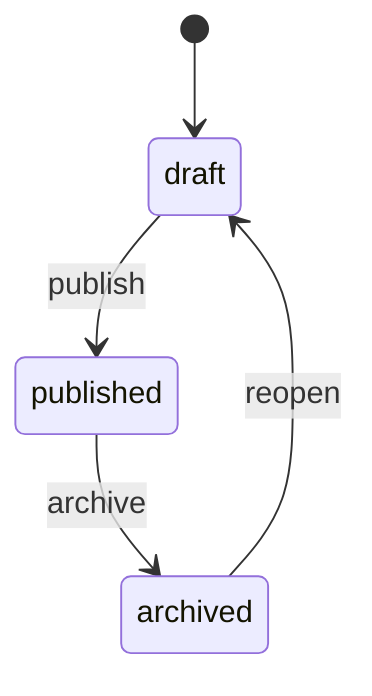
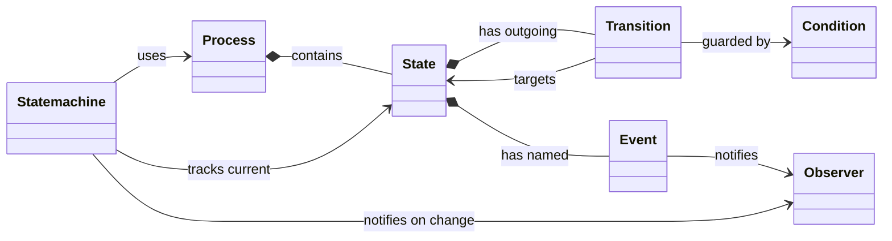

<div align="center">

<picture>
  
</picture>

<br>

[](https://github.com/camcima/finita/actions/workflows/ci.yml)
[](https://codecov.io/gh/camcima/finita)
[](https://www.npmjs.com/package/finita)
[](https://opensource.org/licenses/MIT)
[](https://www.typescriptlang.org/)
[](https://nodejs.org/)

</div>

A full-featured finite state machine (FSM) library for TypeScript.

This library is a TypeScript port of [metabor/statemachine](https://github.com/Metabor/Statemachine), the PHP state machine library created by **Oliver Tischlinger**. The original library was the engine behind _Bob_ -- the backend component of the _Alice & Bob_ retail system that [Rocket Internet](https://www.rocket-internet.com/) used to power its e-commerce ventures worldwide. The author of this TypeScript port and Oliver worked together at Rocket Internet, where the state machine proved itself at scale across multiple global operations.

## Features

- **Async-First** -- all conditions, observers, and mutexes support async operations via `MaybePromise<T>` return types
- **States, Transitions, Events** -- define complex workflows declaratively
- **Conditions (Guards)** -- control when transitions are allowed, with composable AND/OR/NOT logic
- **Observers (Commands)** -- execute side effects when events fire or states change
- **Automatic Transitions** -- transitions that fire when a condition becomes true, without an explicit event
- **Transition Selectors** -- pluggable strategies for resolving ambiguous transitions (score-based, weight-based)
- **Mutex/Locking** -- concurrency control with pluggable lock adapters
- **Factory Pattern** -- create pre-configured state machines from subject objects
- **Process Merging** -- combine state collections with optional name prefixing
- **Graph Visualization** -- build graph data structures for rendering with GraphViz or other tools
- **Setup Helper** -- fluent API for building state machines from configuration
- **Zero Dependencies** -- no runtime dependencies

## Installation

```bash
npm install finita
```

## Quick Start



```typescript
import { State, Transition, Process, Statemachine } from "finita";

// Define states
const draft = new State("draft");
const published = new State("published");
const archived = new State("archived");

// Define transitions
draft.addTransition(new Transition(published, "publish"));
published.addTransition(new Transition(archived, "archive"));
archived.addTransition(new Transition(draft, "reopen"));

// Create process and state machine
const process = new Process("article-workflow", draft);
const article = { title: "Hello World" };
const sm = new Statemachine(article, process);

console.log(sm.getCurrentState().getName()); // 'draft'

await sm.triggerEvent("publish");
console.log(sm.getCurrentState().getName()); // 'published'

await sm.triggerEvent("archive");
console.log(sm.getCurrentState().getName()); // 'archived'

// Note: use top-level await (supported in ES modules) or wrap in an async function.
```

## Concepts

A state machine consists of:

| Concept          | Description                                                                                                          |
| ---------------- | -------------------------------------------------------------------------------------------------------------------- |
| **State**        | A named node in the workflow graph. Holds transitions, events, and metadata.                                         |
| **Transition**   | A directed edge from one state to another, optionally guarded by a condition and triggered by an event.              |
| **Event**        | A named trigger attached to a state. When invoked, it fires observers (commands) and initiates transitions.          |
| **Condition**    | A guard that determines whether a transition is active.                                                              |
| **Process**      | A named collection of states that defines a complete workflow, starting from an initial state.                       |
| **Statemachine** | The runtime orchestrator that manages the current state, triggers events, checks conditions, and notifies observers. |
| **Observer**     | A callback that reacts to events or state changes.                                                                   |



## Documentation

Detailed documentation for every component:

- **[Core](docs/core.md)** -- State, Transition, Event, Process, Statemachine, Dispatcher, StateCollection
- **[Conditions](docs/conditions.md)** -- Tautology, Contradiction, CallbackCondition, Timeout, AndComposite, OrComposite, Not
- **[Observers](docs/observers.md)** -- CallbackObserver, StatefulStatusChanger, OnEnterObserver, TransitionLogger
- **[Filters](docs/filters.md)** -- ActiveTransitionFilter, FilterStateByEvent, FilterStateByTransition, FilterStateByFinalState, FilterTransitionByEvent
- **[Selectors](docs/selectors.md)** -- OneOrNoneActiveTransition, ScoreTransition, WeightTransition
- **[Mutex](docs/mutex.md)** -- NullMutex, LockAdapterMutex, MutexFactory
- **[Factory](docs/factory.md)** -- Factory, SingleProcessDetector, AbstractNamedProcessDetector, StatefulStateNameDetector
- **[Utilities](docs/utilities.md)** -- SetupHelper, StateCollectionMerger
- **[Graph](docs/graph.md)** -- GraphBuilder
- **[Errors](docs/errors.md)** -- WrongEventForStateError, LockCanNotBeAcquiredError, DuplicateStateError
- **[Interfaces](docs/interfaces.md)** -- All TypeScript interfaces

## Examples

A complete working example (order processing with prepayment and postpayment workflows) is available in the [finita-example](https://github.com/camcima/finita-example) repository.

## Architecture

```
src/
  index.ts                 # Barrel export
  MaybePromise.ts          # MaybePromise<T> = T | Promise<T> utility type
  Event.ts                 # Event implementation
  State.ts                 # State implementation
  Transition.ts            # Transition implementation
  StateCollection.ts       # Named collection of states
  Process.ts               # Process (workflow definition)
  Statemachine.ts          # Runtime state machine
  Dispatcher.ts            # Deferred event dispatcher
  interfaces/              # All TypeScript interfaces
  condition/               # Condition (guard) implementations
  observer/                # Observer implementations
  filter/                  # State and transition filters
  selector/                # Transition selection strategies
  mutex/                   # Locking implementations
  factory/                 # State machine factory pattern
  util/                    # SetupHelper, StateCollectionMerger
  graph/                   # Graph visualization builder
  error/                   # Custom error classes
```

## Development

```bash
# Install dependencies
npm install

# Run tests
npm test

# Run tests in watch mode
npm run test:watch

# Type check
npm run lint

# Build
npm run build
```

## License

MIT
