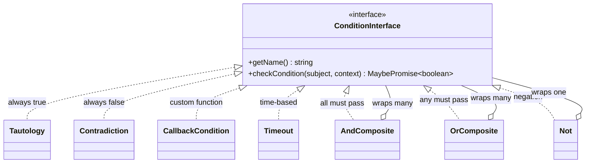

# Conditions

Conditions (also called guards) control whether a transition is active. Every condition implements the `ConditionInterface`:

```typescript
import type { MaybePromise } from "finita";

// MaybePromise<T> = T | Promise<T>

interface ConditionInterface extends Named {
  checkCondition(
    subject: unknown,
    context: Map<string, unknown>,
  ): MaybePromise<boolean>;
}
```

> **Note:** Synchronous conditions that return `boolean` directly still work because `boolean` satisfies `MaybePromise<boolean>`.

The `subject` is the domain object managed by the state machine. The `context` is a `Map<string, unknown>` passed when triggering events or checking transitions.

## Condition Name as Identity

A condition's `getName()` value serves as its **semantic identity**, not just a display label. Two transitions that share the same target state, event name, and condition name are considered duplicates — even if they reference different condition objects with different logic.

This means:

```typescript
const c1 = new CallbackCondition("isReady", () => checkDatabase());
const c2 = new CallbackCondition("isReady", () => checkCache());

// These are treated as the same transition — c2 is silently ignored
state.addTransition(new Transition(target, "go", c1));
state.addTransition(new Transition(target, "go", c2));
```

**Give each distinct condition a unique name.** If two conditions do different things, they must have different names. The name is how the library distinguishes them during transition deduplication, graph export, and setup helpers.

## Overview



## Table of Contents

- [Tautology](#tautology)
- [Contradiction](#contradiction)
- [CallbackCondition](#callbackcondition)
- [Timeout](#timeout)
- [AndComposite](#andcomposite)
- [OrComposite](#orcomposite)
- [Not](#not)
- [Custom Conditions](#custom-conditions)

---

## Tautology

**Import:** `import { Tautology } from 'finita'`

A condition that always returns `true`. Useful as a default/placeholder condition or for automatic transitions that should always fire.

### Constructor

```typescript
new Tautology(name?: string)
```

| Parameter | Type     | Default       | Description        |
| --------- | -------- | ------------- | ------------------ |
| `name`    | `string` | `'Tautology'` | The condition name |

### Example

```typescript
import { Tautology, Transition, State } from "finita";

const always = new Tautology("always proceed");
const s1 = new State("s1");
const s2 = new State("s2");

// Automatic transition that always fires
s1.addTransition(new Transition(s2, null, always));
```

---

## Contradiction

**Import:** `import { Contradiction } from 'finita'`

A condition that always returns `false`. Useful for temporarily disabling transitions or as a base case in composite conditions.

### Constructor

```typescript
new Contradiction(name?: string)
```

| Parameter | Type     | Default           | Description        |
| --------- | -------- | ----------------- | ------------------ |
| `name`    | `string` | `'Contradiction'` | The condition name |

### Example

```typescript
import { Contradiction, Transition, State } from "finita";

const never = new Contradiction("blocked");
const s1 = new State("s1");
const s2 = new State("s2");

// This transition can never fire
s1.addTransition(new Transition(s2, "go", never));
```

---

## CallbackCondition

**Import:** `import { CallbackCondition } from 'finita'`

Wraps a function as a condition. This is the most common way to create custom guards.

### Constructor

```typescript
new CallbackCondition(name: string, callable: ConditionCallbackFn)
```

| Parameter  | Type                                                                         | Description                                                              |
| ---------- | ---------------------------------------------------------------------------- | ------------------------------------------------------------------------ |
| `name`     | `string`                                                                     | The condition name (used as identity for deduplication and graph labels) |
| `callable` | `(subject: unknown, context: Map<string, unknown>) => MaybePromise<boolean>` | The guard function                                                       |

### Example

```typescript
import { CallbackCondition, Transition, State } from "finita";

// Check subject property
const isApproved = new CallbackCondition("isApproved", (subject) => {
  return (subject as Order).approved === true;
});

// Check context value
const hasPriority = new CallbackCondition(
  "hasPriority",
  (_subject, context) => {
    return context.get("priority") === "high";
  },
);

// Use in transitions
pending.addTransition(new Transition(approved, "submit", isApproved));
```

### Type: `ConditionCallbackFn`

```typescript
type ConditionCallbackFn = (
  subject: unknown,
  context: Map<string, unknown>,
) => MaybePromise<boolean>;
```

---

## Timeout

**Import:** `import { Timeout } from 'finita'`

A time-based condition that returns `true` when a specified duration has elapsed since the subject's last state change. The subject must implement `LastStateHasChangedDateInterface`.

### Constructor

```typescript
new Timeout(timeoutMs: number, label?: string)
```

| Parameter   | Type     | Default            | Description                          |
| ----------- | -------- | ------------------ | ------------------------------------ |
| `timeoutMs` | `number` | (required)         | Timeout in milliseconds              |
| `label`     | `string` | `'${timeoutMs}ms'` | Human-readable label for the timeout |

### Required Subject Interface

```typescript
interface LastStateHasChangedDateInterface {
  getLastStateHasChangedDate(): Date;
}
```

If the subject does not implement this interface, `checkCondition()` throws an error.

### Example

```typescript
import { Timeout, Transition, State } from "finita";

// Transition fires 24 hours after entering the current state
const dayTimeout = new Timeout(24 * 60 * 60 * 1000, "24 hours");

active.addTransition(new Transition(expired, null, dayTimeout));

// Subject must implement the interface
class Subscription {
  private stateChangedAt = new Date();

  getLastStateHasChangedDate(): Date {
    return this.stateChangedAt;
  }
}
```

### How It Works

The condition calculates `lastStateChangedDate + timeoutMs` and returns `true` if that time is in the past (i.e., the timeout has elapsed).

---

## AndComposite

**Import:** `import { AndComposite } from 'finita'`

Combines multiple conditions with logical AND. Returns `true` only if **all** conditions are `true`. Short-circuits on the first `false`.

### Constructor

```typescript
new AndComposite(condition: ConditionInterface)
```

### Methods

| Method                             | Return Type        | Description                                                           |
| ---------------------------------- | ------------------ | --------------------------------------------------------------------- |
| `addAnd(condition)`                | `this`             | Adds another condition to the AND chain. Returns `this` for chaining. |
| `getName()`                        | `string`           | Returns `'(A and B and ...)'`                                         |
| `checkCondition(subject, context)` | `Promise<boolean>` | Returns `true` if all conditions are `true`                           |

### Example

```typescript
import { AndComposite, CallbackCondition } from "finita";

const isActive = new CallbackCondition("isActive", (s) => (s as any).active);
const isPaid = new CallbackCondition("isPaid", (s) => (s as any).paid);

const canShip = new AndComposite(isActive);
canShip.addAnd(isPaid);

console.log(canShip.getName()); // '(isActive and isPaid)'
```

---

## OrComposite

**Import:** `import { OrComposite } from 'finita'`

Combines multiple conditions with logical OR. Returns `true` if **any** condition is `true`. Short-circuits on the first `true`.

### Constructor

```typescript
new OrComposite(condition: ConditionInterface)
```

### Methods

| Method                             | Return Type        | Description                                                          |
| ---------------------------------- | ------------------ | -------------------------------------------------------------------- |
| `addOr(condition)`                 | `this`             | Adds another condition to the OR chain. Returns `this` for chaining. |
| `getName()`                        | `string`           | Returns `'(A or B or ...)'`                                          |
| `checkCondition(subject, context)` | `Promise<boolean>` | Returns `true` if any condition is `true`                            |

### Example

```typescript
import { OrComposite, CallbackCondition } from "finita";

const isAdmin = new CallbackCondition(
  "isAdmin",
  (s) => (s as any).role === "admin",
);
const isOwner = new CallbackCondition("isOwner", (s) => (s as any).isOwner);

const canEdit = new OrComposite(isAdmin);
canEdit.addOr(isOwner);

console.log(canEdit.getName()); // '(isAdmin or isOwner)'
```

---

## Not

**Import:** `import { Not } from 'finita'`

Negates another condition. Returns `true` when the inner condition returns `false`, and vice versa.

### Constructor

```typescript
new Not(condition: ConditionInterface)
```

### Methods

| Method                             | Return Type        | Description                                   |
| ---------------------------------- | ------------------ | --------------------------------------------- |
| `getName()`                        | `string`           | Returns `'not ( innerName )'`                 |
| `checkCondition(subject, context)` | `Promise<boolean>` | Returns `!innerCondition.checkCondition(...)` |

### Example

```typescript
import { Not, CallbackCondition, Transition, State } from "finita";

const isExpired = new CallbackCondition("isExpired", (s) => (s as any).expired);
const isNotExpired = new Not(isExpired);

console.log(isNotExpired.getName()); // 'not ( isExpired )'

// Use for conditional transitions
active.addTransition(new Transition(renewed, "renew", isNotExpired));
```

---

## Custom Conditions

You can create your own condition classes by implementing `ConditionInterface`:

```typescript
import type { ConditionInterface, MaybePromise } from "finita";

class MinimumBalance implements ConditionInterface {
  private readonly minimum: number;

  constructor(minimum: number) {
    this.minimum = minimum;
  }

  getName(): string {
    return `balance >= ${this.minimum}`;
  }

  checkCondition(
    subject: unknown,
    context: Map<string, unknown>,
  ): MaybePromise<boolean> {
    const account = subject as { balance: number };
    return account.balance >= this.minimum;
  }
}

// Usage
const canWithdraw = new MinimumBalance(100);
active.addTransition(new Transition(withdrawn, "withdraw", canWithdraw));
```

### Composing Conditions

All condition types can be combined:

```typescript
const hasBalance = new CallbackCondition(
  "hasBalance",
  (s) => (s as any).balance > 0,
);
const isVerified = new CallbackCondition(
  "isVerified",
  (s) => (s as any).verified,
);
const isBlocked = new CallbackCondition("isBlocked", (s) => (s as any).blocked);

// (hasBalance AND isVerified) AND NOT isBlocked
const canTransfer = new AndComposite(hasBalance);
canTransfer.addAnd(isVerified);
canTransfer.addAnd(new Not(isBlocked));
```
