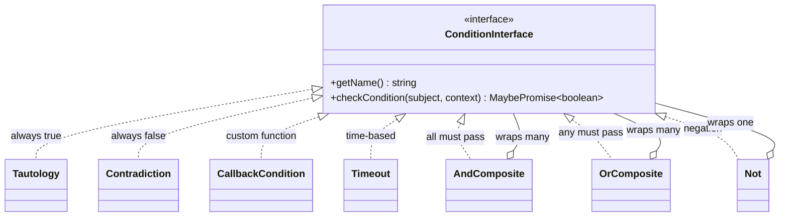

# Conditions

Conditions (also called guards) control whether a transition is active. Every condition implements the `ConditionInterface`:

```typescript
import type { MaybePromise } from "@camcima/finita";

// MaybePromise<T> = T | Promise<T>

interface ConditionInterface<TSubject = unknown> extends Named {
  checkCondition(
    subject: TSubject,
    context: Map<string, unknown>,
  ): MaybePromise<boolean>;
}
```

> **Note:** Synchronous conditions that return `boolean` directly still work because `boolean` satisfies `MaybePromise<boolean>`.

The `subject` is the domain object managed by the state machine. The `context` is a `Map<string, unknown>` passed when triggering events or checking transitions.

## Condition Identity for Deduplication

`ProcessBuilder` deduplicates transitions by `(fromState, event, toState, condition reference)`. Two declarations with the same `(fromState, event, toState)` triple and the **same condition object reference** are silently merged — declaring the same transition twice is idempotent. Two declarations sharing the same triple but referring to **different condition objects** throw `DuplicateTransitionError` at build time, regardless of whether the conditions share a `getName()` value.

The library cannot introspect a callable's body to compare logic, so different object identity is treated as different logic.

```typescript
import {
  ProcessBuilder,
  CallbackCondition,
  DuplicateTransitionError,
} from "@camcima/finita";

const checkReady = new CallbackCondition("isReady", () => checkDatabase());

// Same reference declared twice → silently dedup'd, one transition built.
new ProcessBuilder("idempotent")
  .addState("source", { initial: true })
  .addState("target")
  .addTransition("source", "target", { event: "go", condition: checkReady })
  .addTransition("source", "target", { event: "go", condition: checkReady })
  .build();

// Different references with the same name → conflict, throws at build time.
const a = new CallbackCondition("isReady", () => checkDatabase());
const b = new CallbackCondition("isReady", () => checkCache());
expect(() =>
  new ProcessBuilder("conflicting")
    .addState("source", { initial: true })
    .addState("target")
    .addTransition("source", "target", { event: "go", condition: a })
    .addTransition("source", "target", { event: "go", condition: b })
    .build(),
).toThrow(DuplicateTransitionError);
```

**Reuse the same condition instance when you mean the same condition.** Construct it once and pass the same reference to every `addTransition` that should share it. The `getName()` value is used for graph labels and error messages, not for deduplication.

## Overview


```mermaid
classDiagram
    direction TB
    class ConditionInterface {
        <<interface>>
        +getName() string
        +checkCondition(subject, context) MaybePromise~boolean~
    }
    ConditionInterface <|.. Tautology : always true
    ConditionInterface <|.. Contradiction : always false
    ConditionInterface <|.. CallbackCondition : custom function
    ConditionInterface <|.. Timeout : time-based
    ConditionInterface <|.. AndComposite : all must pass
    ConditionInterface <|.. OrComposite : any must pass
    ConditionInterface <|.. Not : negation
    AndComposite o-- ConditionInterface : wraps many
    OrComposite o-- ConditionInterface : wraps many
    Not o-- ConditionInterface : wraps one
```

## Table of Contents

- [Tautology](#tautology)
- [Contradiction](#contradiction)
- [CallbackCondition](#callbackcondition)
- [Timeout](#timeout)
- [AndComposite](#andcomposite)
- [OrComposite](#orcomposite)
- [Not](#not)
- [Custom Conditions](#custom-conditions)

---

## Tautology

**Import:** `import { Tautology } from '@camcima/finita'`

A condition that always returns `true`. Useful as a default/placeholder condition or for automatic transitions that should always fire.

### Constructor

```typescript
new Tautology(name?: string)
```

| Parameter | Type     | Default       | Description        |
| --------- | -------- | ------------- | ------------------ |
| `name`    | `string` | `'Tautology'` | The condition name |

### Example

```typescript
import { Tautology, ProcessBuilder } from "@camcima/finita";

const always = new Tautology("always proceed");

const process = new ProcessBuilder("example")
  .addState("s1", { initial: true })
  .addState("s2")
  // Automatic transition that always fires
  .addTransition("s1", "s2", { condition: always })
  .build();
```

---

## Contradiction

**Import:** `import { Contradiction } from '@camcima/finita'`

A condition that always returns `false`. Useful for temporarily disabling transitions or as a base case in composite conditions.

### Constructor

```typescript
new Contradiction(name?: string)
```

| Parameter | Type     | Default           | Description        |
| --------- | -------- | ----------------- | ------------------ |
| `name`    | `string` | `'Contradiction'` | The condition name |

### Example

```typescript
import { Contradiction, ProcessBuilder } from "@camcima/finita";

const never = new Contradiction("blocked");

const process = new ProcessBuilder("example")
  .addState("s1", { initial: true })
  .addState("s2")
  // This transition can never fire
  .addTransition("s1", "s2", { event: "go", condition: never })
  .build();
```

---

## CallbackCondition

**Import:** `import { CallbackCondition } from '@camcima/finita'`

Wraps a function as a condition. This is the most common way to create custom guards.

### Constructor

```typescript
new CallbackCondition<TSubject = unknown>(name: string, callable: ConditionCallbackFn<TSubject>)
```

| Parameter  | Type                                                                          | Description                                                   |
| ---------- | ----------------------------------------------------------------------------- | ------------------------------------------------------------- |
| `name`     | `string`                                                                      | The condition name (used for graph labels and error messages) |
| `callable` | `(subject: TSubject, context: Map<string, unknown>) => MaybePromise<boolean>` | The guard function                                            |

### Example

```typescript
import { CallbackCondition, Transition, State } from "@camcima/finita";

interface Order {
  approved: boolean;
  total: number;
}

// Type-safe: subject is typed as Order -- no cast needed
const isApproved = new CallbackCondition<Order>(
  "isApproved",
  (order) => order.approved === true,
);

// Check context value (untyped -- works without a type parameter)
const hasPriority = new CallbackCondition(
  "hasPriority",
  (_subject, context) => {
    return context.get("priority") === "high";
  },
);

// Use in transitions
const process = new ProcessBuilder("example")
  .addState("pending", { initial: true })
  .addState("approved")
  .addTransition("pending", "approved", {
    event: "submit",
    condition: isApproved,
  })
  .build();
```

### Type: `ConditionCallbackFn`

```typescript
type ConditionCallbackFn<TSubject = unknown> = (
  subject: TSubject,
  context: Map<string, unknown>,
) => MaybePromise<boolean>;
```

---

## Timeout

**Import:** `import { Timeout } from '@camcima/finita'`

A time-based condition that returns `true` when a specified duration has elapsed since the subject's last state change. The subject must implement `LastStateHasChangedDateInterface`.

### Constructor

```typescript
new Timeout(timeoutMs: number, label?: string)
```

| Parameter   | Type     | Default            | Description                          |
| ----------- | -------- | ------------------ | ------------------------------------ |
| `timeoutMs` | `number` | (required)         | Timeout in milliseconds              |
| `label`     | `string` | `'${timeoutMs}ms'` | Human-readable label for the timeout |

### Required Subject Interface

```typescript
interface LastStateHasChangedDateInterface {
  getLastStateHasChangedDate(): Date;
}
```

If the subject does not implement this interface, `checkCondition()` throws an error.

### Example

```typescript
import { Timeout, Transition, State } from "@camcima/finita";

// Transition fires 24 hours after entering the current state
const dayTimeout = new Timeout(24 * 60 * 60 * 1000, "24 hours");

active.addTransition(new Transition(expired, null, dayTimeout));

// Subject must implement the interface
class Subscription {
  private stateChangedAt = new Date();

  getLastStateHasChangedDate(): Date {
    return this.stateChangedAt;
  }
}
```

### How It Works

The condition calculates `lastStateChangedDate + timeoutMs` and returns `true` if that time is in the past (i.e., the timeout has elapsed).

---

## AndComposite

**Import:** `import { AndComposite } from '@camcima/finita'`

Combines multiple conditions with logical AND. Returns `true` only if **all** conditions are `true`. Short-circuits on the first `false`.

### Constructor

```typescript
new AndComposite<TSubject = unknown>(condition: ConditionInterface<TSubject>)
```

### Methods

| Method                             | Return Type        | Description                                                           |
| ---------------------------------- | ------------------ | --------------------------------------------------------------------- |
| `addAnd(condition)`                | `this`             | Adds another condition to the AND chain. Returns `this` for chaining. |
| `getName()`                        | `string`           | Returns `'(A and B and ...)'`                                         |
| `checkCondition(subject, context)` | `Promise<boolean>` | Returns `true` if all conditions are `true`                           |

### Example

```typescript
import { AndComposite, CallbackCondition } from "@camcima/finita";

const isActive = new CallbackCondition("isActive", (s) => (s as any).active);
const isPaid = new CallbackCondition("isPaid", (s) => (s as any).paid);

const canShip = new AndComposite(isActive);
canShip.addAnd(isPaid);

console.log(canShip.getName()); // '(isActive and isPaid)'
```

---

## OrComposite

**Import:** `import { OrComposite } from '@camcima/finita'`

Combines multiple conditions with logical OR. Returns `true` if **any** condition is `true`. Short-circuits on the first `true`.

### Constructor

```typescript
new OrComposite<TSubject = unknown>(condition: ConditionInterface<TSubject>)
```

### Methods

| Method                             | Return Type        | Description                                                          |
| ---------------------------------- | ------------------ | -------------------------------------------------------------------- |
| `addOr(condition)`                 | `this`             | Adds another condition to the OR chain. Returns `this` for chaining. |
| `getName()`                        | `string`           | Returns `'(A or B or ...)'`                                          |
| `checkCondition(subject, context)` | `Promise<boolean>` | Returns `true` if any condition is `true`                            |

### Example

```typescript
import { OrComposite, CallbackCondition } from "@camcima/finita";

const isAdmin = new CallbackCondition(
  "isAdmin",
  (s) => (s as any).role === "admin",
);
const isOwner = new CallbackCondition("isOwner", (s) => (s as any).isOwner);

const canEdit = new OrComposite(isAdmin);
canEdit.addOr(isOwner);

console.log(canEdit.getName()); // '(isAdmin or isOwner)'
```

---

## Not

**Import:** `import { Not } from '@camcima/finita'`

Negates another condition. Returns `true` when the inner condition returns `false`, and vice versa.

### Constructor

```typescript
new Not<TSubject = unknown>(condition: ConditionInterface<TSubject>)
```

### Methods

| Method                             | Return Type        | Description                                   |
| ---------------------------------- | ------------------ | --------------------------------------------- |
| `getName()`                        | `string`           | Returns `'not ( innerName )'`                 |
| `checkCondition(subject, context)` | `Promise<boolean>` | Returns `!innerCondition.checkCondition(...)` |

### Example

```typescript
import { Not, CallbackCondition, ProcessBuilder } from "@camcima/finita";

const isExpired = new CallbackCondition("isExpired", (s) => (s as any).expired);
const isNotExpired = new Not(isExpired);

console.log(isNotExpired.getName()); // 'not ( isExpired )'

// Use for conditional transitions
const process = new ProcessBuilder("example")
  .addState("active", { initial: true })
  .addState("renewed")
  .addTransition("active", "renewed", {
    event: "renew",
    condition: isNotExpired,
  })
  .build();
```

---

## Custom Conditions

You can create your own condition classes by implementing `ConditionInterface`:

```typescript
import type { ConditionInterface, MaybePromise } from "@camcima/finita";

interface Account {
  balance: number;
}

class MinimumBalance implements ConditionInterface<Account> {
  private readonly minimum: number;

  constructor(minimum: number) {
    this.minimum = minimum;
  }

  getName(): string {
    return `balance >= ${this.minimum}`;
  }

  checkCondition(
    subject: Account,
    context: Map<string, unknown>,
  ): MaybePromise<boolean> {
    return subject.balance >= this.minimum; // subject is typed as Account
  }
}

// Usage
const canWithdraw = new MinimumBalance(100);
const process = new ProcessBuilder("account")
  .addState("active", { initial: true })
  .addState("withdrawn")
  .addTransition("active", "withdrawn", {
    event: "withdraw",
    condition: canWithdraw,
  })
  .build();
```

### Composing Conditions

All condition types can be combined:

```typescript
const hasBalance = new CallbackCondition(
  "hasBalance",
  (s) => (s as any).balance > 0,
);
const isVerified = new CallbackCondition(
  "isVerified",
  (s) => (s as any).verified,
);
const isBlocked = new CallbackCondition("isBlocked", (s) => (s as any).blocked);

// (hasBalance AND isVerified) AND NOT isBlocked
const canTransfer = new AndComposite(hasBalance);
canTransfer.addAnd(isVerified);
canTransfer.addAnd(new Not(isBlocked));
```
