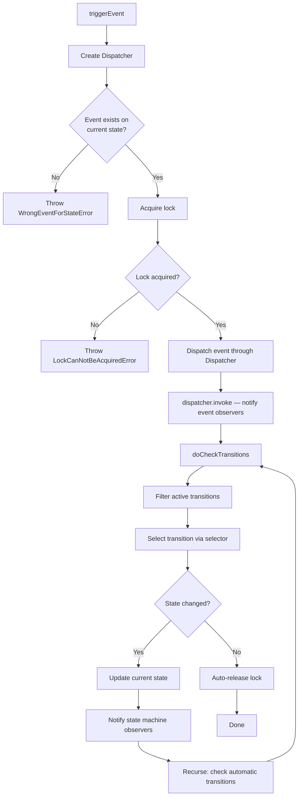

# Core

The core module contains the fundamental building blocks of the state machine: states, transitions, events, processes, the state machine itself, the event dispatcher, and state collections.

## Table of Contents

- [State](#state)
- [Transition](#transition)
- [Event](#event)
- [Process](#process)
- [Statemachine](#statemachine)
- [Dispatcher](#dispatcher)
- [StateCollection](#statecollection)

---

## State

**Import:** `import { State } from 'finita'`

A state represents a named node in the workflow graph. Each state can hold outgoing transitions, named events, and arbitrary metadata.

### Constructor

```typescript
new State(name: string)
```

| Parameter | Type     | Description                                         |
| --------- | -------- | --------------------------------------------------- |
| `name`    | `string` | Unique name identifying this state within a process |

### Methods

| Method                         | Return Type                     | Description                                                                                                              |
| ------------------------------ | ------------------------------- | ------------------------------------------------------------------------------------------------------------------------ |
| `getName()`                    | `string`                        | Returns the state name                                                                                                   |
| `addTransition(transition)`    | `void`                          | Adds an outgoing transition. If the transition has an event name, the corresponding event is auto-created on this state. |
| `getTransitions()`             | `Iterable<TransitionInterface>` | Returns all outgoing transitions                                                                                         |
| `hasEvent(name)`               | `boolean`                       | Checks if an event exists on this state                                                                                  |
| `getEvent(name)`               | `EventInterface`                | Returns the event with the given name. If it doesn't exist, it is **created on demand**.                                 |
| `getEventNames()`              | `string[]`                      | Returns the names of all events on this state                                                                            |
| `getMetadata()`                | `Record<string, unknown>`       | Returns all metadata as a plain object                                                                                   |
| `getMetadataValue(key)`        | `unknown`                       | Returns the value for a metadata key                                                                                     |
| `setMetadataValue(key, value)` | `void`                          | Sets a metadata key-value pair                                                                                           |
| `hasMetadataValue(key)`        | `boolean`                       | Checks if a metadata key exists                                                                                          |
| `deleteMetadataValue(key)`     | `void`                          | Removes a metadata key                                                                                                   |

### Example

```typescript
import { State, Transition } from "finita";

const open = new State("open");
const closed = new State("closed");

// Add transitions
open.addTransition(new Transition(closed, "close"));
closed.addTransition(new Transition(open, "open"));

// Events are auto-created when adding transitions with event names
console.log(open.hasEvent("close")); // true
console.log(open.getEventNames()); // ['close']

// Metadata
open.setMetadataValue("color", "green");
console.log(open.getMetadataValue("color")); // 'green'

// Events are created on demand
const event = open.getEvent("myEvent");
console.log(open.hasEvent("myEvent")); // true
```

### Key Behaviors

- **Auto-created events:** When you call `addTransition()` with a transition that has an event name, the state automatically creates the corresponding `Event` object if it doesn't already exist.
- **On-demand events:** `getEvent()` creates the event if it doesn't exist, making it safe to call at any time.
- **Automatic transitions:** Transitions with no event name (`null`) do not create events. They are used for condition-based automatic transitions.

---

## Transition

**Import:** `import { Transition } from 'finita'`

A transition represents a directed edge from one state to another. It can optionally be associated with an event name and a condition (guard).

### Constructor

```typescript
new Transition(
  targetState: StateInterface,
  eventName?: string | null,
  condition?: ConditionInterface | null
)
```

| Parameter     | Type                         | Default    | Description                                                                       |
| ------------- | ---------------------------- | ---------- | --------------------------------------------------------------------------------- |
| `targetState` | `StateInterface`             | (required) | The state to transition to                                                        |
| `eventName`   | `string \| null`             | `null`     | The event that triggers this transition. `null` makes it an automatic transition. |
| `condition`   | `ConditionInterface \| null` | `null`     | A guard condition that must be `true` for the transition to be active             |

### Methods

| Method                               | Return Type                  | Description                                                 |
| ------------------------------------ | ---------------------------- | ----------------------------------------------------------- |
| `getTargetState()`                   | `StateInterface`             | Returns the target state                                    |
| `getEventName()`                     | `string \| null`             | Returns the event name, or `null` for automatic transitions |
| `getConditionName()`                 | `string \| null`             | Returns the condition name, or `null` if no condition       |
| `getCondition()`                     | `ConditionInterface \| null` | Returns the condition object                                |
| `isActive(subject, context, event?)` | `Promise<boolean>`           | Determines if this transition is currently active           |
| `getWeight()`                        | `number`                     | Returns the weight (default: `1`)                           |
| `setWeight(weight)`                  | `void`                       | Sets the weight                                             |

### How `isActive()` Works

A transition is active when **both** of these are true:

1. **Event match:** If an `event` is provided, the event name must match the transition's event name. If no `event` is provided, the transition must be automatic (`eventName === null`).
2. **Condition check:** If the transition has a condition, it must return `true`.

### Types of Transitions

#### Event-Based Transition

Triggered explicitly by calling `statemachine.triggerEvent()`.

```typescript
const transition = new Transition(targetState, "approve");
```

#### Automatic Transition

Has no event name. Fires automatically when its condition is true, checked by `statemachine.checkTransitions()` or as part of the recursive transition-checking after any state change.

```typescript
const condition = new CallbackCondition("isExpired", (subject) =>
  subject.isExpired(),
);
const transition = new Transition(targetState, null, condition);
```

#### Conditional Event Transition

Triggered by an event, but only if the condition is also true.

```typescript
const condition = new CallbackCondition(
  "hasPermission",
  (subject) => subject.canApprove,
);
const transition = new Transition(approved, "approve", condition);
```

### Weight

Transitions have a weight (default: `1`) used by the `WeightTransition` selector to resolve ambiguity when multiple transitions are active.

```typescript
const urgentTransition = new Transition(targetState, "process");
urgentTransition.setWeight(10);
```

---

## Event

**Import:** `import { Event } from 'finita'`

An event is a named trigger that notifies attached observers when invoked. Events implement the Observer pattern and carry invoke arguments and metadata.

### Constructor

```typescript
new Event(name: string)
```

### Methods

| Method                         | Return Type               | Description                                                               |
| ------------------------------ | ------------------------- | ------------------------------------------------------------------------- |
| `getName()`                    | `string`                  | Returns the event name                                                    |
| `invoke(...args)`              | `Promise<void>`           | Sets invoke args, notifies all observers, then clears args                |
| `getInvokeArgs()`              | `unknown[]`               | Returns the current invoke arguments (only available during notification) |
| `attach(observer)`             | `void`                    | Adds an observer                                                          |
| `detach(observer)`             | `void`                    | Removes an observer                                                       |
| `notify()`                     | `Promise<void>`           | Notifies all attached observers                                           |
| `getObservers()`               | `Iterable<Observer>`      | Returns all attached observers                                            |
| `getMetadata()`                | `Record<string, unknown>` | Returns all metadata                                                      |
| `getMetadataValue(key)`        | `unknown`                 | Returns metadata value                                                    |
| `setMetadataValue(key, value)` | `void`                    | Sets metadata value                                                       |
| `hasMetadataValue(key)`        | `boolean`                 | Checks if metadata key exists                                             |
| `deleteMetadataValue(key)`     | `void`                    | Removes metadata key                                                      |

### Invoke Flow

When `invoke()` is called:

1. The invoke arguments are stored on the event
2. `notify()` is called, iterating over all observers
3. Each observer's `update(event)` is awaited sequentially -- observers can access arguments via `event.getInvokeArgs()`
4. After all observers are notified, the invoke arguments are cleared

### Example

```typescript
import { Event, CallbackObserver } from "finita";

const event = new Event("userRegistered");

// Attach observers
event.attach(
  new CallbackObserver((subject, context) => {
    console.log("Send welcome email to", subject.email);
  }),
);

event.attach(
  new CallbackObserver((subject, context) => {
    console.log("Log registration for", subject.email);
  }),
);

// When the statemachine invokes this event, both observers fire
// Arguments are: (subject, context) -- passed by the statemachine
```

---

## Process

**Import:** `import { Process } from 'finita'`

A process defines a complete workflow as a named collection of states. It auto-discovers all reachable states by walking the transition graph from the initial state.

### Constructor

```typescript
new Process(name: string, initialState: StateInterface)
```

| Parameter      | Type             | Description                          |
| -------------- | ---------------- | ------------------------------------ |
| `name`         | `string`         | The process name                     |
| `initialState` | `StateInterface` | The starting state for this workflow |

### Methods

| Method              | Return Type                | Description                   |
| ------------------- | -------------------------- | ----------------------------- |
| `getName()`         | `string`                   | Returns the process name      |
| `getInitialState()` | `StateInterface`           | Returns the initial state     |
| `getStates()`       | `Iterable<StateInterface>` | Returns all discovered states |
| `getState(name)`    | `StateInterface`           | Returns a state by name       |
| `hasState(name)`    | `boolean`                  | Checks if a state exists      |

### Immutability

A `Process` is **immutable after construction**. There are no methods to add or remove states after creation. To build a state graph incrementally, use `StateCollection` with `SetupHelper`, then pass the initial state to the `Process` constructor.

### Auto-Discovery

The constructor recursively walks all transitions from the initial state and registers every reachable state. This means you only need to define states and transitions -- the process discovers the complete graph automatically.

```typescript
const s1 = new State("s1");
const s2 = new State("s2");
const s3 = new State("s3");

s1.addTransition(new Transition(s2, "next"));
s2.addTransition(new Transition(s3, "next"));

const process = new Process("workflow", s1);

console.log(process.hasState("s1")); // true
console.log(process.hasState("s2")); // true -- auto-discovered
console.log(process.hasState("s3")); // true -- auto-discovered
```

### Duplicate Detection

If two different `State` instances have the same name, the constructor throws an error:

```typescript
const s1 = new State("shared");
const s2 = new State("shared"); // Different instance, same name!

s1.addTransition(new Transition(s2, "go"));
new Process("test", s1); // Error: There is already a different state with name "shared"
```

---

## Statemachine

**Import:** `import { Statemachine } from 'finita'`

The state machine is the runtime orchestrator. It tracks the current state, processes events, evaluates conditions, manages locks, and notifies observers.

### Constructor

```typescript
new Statemachine(
  subject: unknown,
  process: ProcessInterface,
  stateName?: string | null,
  transitionSelector?: TransitionSelectorInterface | null,
  mutex?: MutexInterface | null
)
```

| Parameter            | Type                                  | Default    | Description                                                                               |
| -------------------- | ------------------------------------- | ---------- | ----------------------------------------------------------------------------------------- |
| `subject`            | `unknown`                             | (required) | The domain object being managed (e.g., an Order, Article, etc.)                           |
| `process`            | `ProcessInterface`                    | (required) | The process defining the workflow                                                         |
| `stateName`          | `string \| null`                      | `null`     | Optional initial state name. If `null`, uses `process.getInitialState()`.                 |
| `transitionSelector` | `TransitionSelectorInterface \| null` | `null`     | Strategy for selecting among active transitions. Defaults to `OneOrNoneActiveTransition`. |
| `mutex`              | `MutexInterface \| null`              | `null`     | Mutex for concurrency control. Defaults to `NullMutex`.                                   |

### Methods

| Method                                      | Return Type                    | Description                                                              |
| ------------------------------------------- | ------------------------------ | ------------------------------------------------------------------------ |
| `getCurrentState()`                         | `StateInterface`               | Returns the current state                                                |
| `getLastState()`                            | `StateInterface \| null`       | Returns the previous state (only available during observer notification) |
| `getSubject()`                              | `unknown`                      | Returns the managed subject                                              |
| `getProcess()`                              | `ProcessInterface`             | Returns the process                                                      |
| `getSelectedTransition()`                   | `TransitionInterface \| null`  | Returns the transition being executed (only during notification)         |
| `getCurrentContext()`                       | `Map<string, unknown> \| null` | Returns the current context (only during event processing)               |
| `triggerEvent(name, context?)`              | `Promise<void>`                | Triggers a named event on the current state                              |
| `checkTransitions(context?)`                | `Promise<void>`                | Evaluates automatic transitions                                          |
| `dispatchEvent(dispatcher, name, context?)` | `Promise<void>`                | Advanced: dispatches an event through a custom dispatcher                |
| `acquireLock()`                             | `Promise<boolean>`             | Manually acquires the lock                                               |
| `releaseLock()`                             | `Promise<void>`                | Manually releases the lock                                               |
| `isLockAcquired()`                          | `boolean`                      | Checks if the lock is currently acquired                                 |
| `isAutoreleaseLock()`                       | `boolean`                      | Checks if auto-release is enabled                                        |
| `setAutoreleaseLock(autorelease)`           | `void`                         | Enables/disables auto-release of the lock after event processing         |
| `attach(observer)`                          | `void`                         | Attaches a state machine observer                                        |
| `detach(observer)`                          | `void`                         | Detaches a state machine observer                                        |
| `notify()`                                  | `Promise<void>`                | Notifies all attached observers                                          |
| `getObservers()`                            | `Iterable<Observer>`           | Returns all attached observers                                           |

### Event Processing Flow

When `triggerEvent(name, context?)` is called:



1. A `Dispatcher` is created
2. `dispatchEvent()` validates the event exists on the current state
3. The lock is acquired (throws `LockCanNotBeAcquiredError` if it fails)
4. The event is dispatched (queued) through the dispatcher
5. `dispatcher.invoke()` fires the event, which notifies all event observers with `(subject, context)` as arguments
6. After the dispatcher is ready, `doCheckTransitions()` is called to process the actual state change
7. If the transition leads to a different state, the state changes and state machine observers are notified
8. `doCheckTransitions()` recurses to handle any automatic transitions from the new state
9. The lock is auto-released (if `autoreleaseLock` is `true`)

### Automatic Transitions

After any state change, the state machine recursively checks for automatic transitions (transitions without event names). If an automatic transition's condition is `true`, the state machine moves to the target state and recurses again.

> **Note:** Automatic self-transitions (where the target state is the current state) are not allowed and will throw an error, since they would cause infinite recursion. Use event-based self-transitions instead if you need a self-loop.

```typescript
const active = new State("active");
const expired = new State("expired");

// Automatic transition: fires when condition is true, no event needed
const isExpired = new CallbackCondition("isExpired", (subject) => {
  return Date.now() > subject.expiresAt;
});
active.addTransition(new Transition(expired, null, isExpired));

const process = new Process("subscription", active);
const sm = new Statemachine(subscription, process);

// Check automatic transitions manually
await sm.checkTransitions();
```

### Observer Notification

State machine observers are notified on every **state change** (not on self-transitions). During notification, observers can access:

- `statemachine.getCurrentState()` -- the new state
- `statemachine.getLastState()` -- the previous state
- `statemachine.getSelectedTransition()` -- the transition that was taken
- `statemachine.getSubject()` -- the managed subject
- `statemachine.getCurrentContext()` -- the event context

### Lock Management

By default, the state machine uses a `NullMutex` which always succeeds. For concurrency control, pass a `MutexInterface` implementation.

```typescript
const sm = new Statemachine(subject, process, null, null, myMutex);

// Auto-release (default): lock is released after each triggerEvent/checkTransitions
// Manual lock management:
sm.setAutoreleaseLock(false);
await sm.acquireLock();
await sm.triggerEvent("step1");
await sm.triggerEvent("step2");
await sm.releaseLock();
```

---

## Dispatcher

**Import:** `import { Dispatcher } from 'finita'`

The dispatcher queues events and their arguments for deferred invocation. It is used internally by the state machine to separate event dispatching from event execution.

### Constructor

```typescript
new Dispatcher();
```

### Methods

| Method                                     | Return Type     | Description                                                                         |
| ------------------------------------------ | --------------- | ----------------------------------------------------------------------------------- |
| `dispatch(event, args?, onReadyCallback?)` | `void`          | Queues an event with arguments. Throws if already invoked.                          |
| `invoke()`                                 | `Promise<void>` | Fires all queued events, then calls `onReady` callbacks. Throws if already invoked. |
| `isReady()`                                | `boolean`       | Returns `true` after `invoke()` has been called                                     |

### Example

```typescript
import { Dispatcher, Event, CallbackObserver } from "finita";

const event = new Event("test");
event.attach(new CallbackObserver((...args) => console.log("fired:", args)));

const dispatcher = new Dispatcher();
dispatcher.dispatch(event, ["arg1", "arg2"]);
// Event has not fired yet

await dispatcher.invoke();
// Now fires: "fired: ['arg1', 'arg2']"
```

---

## StateCollection

**Import:** `import { StateCollection } from 'finita'`

A mutable, named collection of states. Used as a building block for `Process` and `SetupHelper`.

### Constructor

```typescript
new StateCollection();
```

### Methods

| Method                       | Return Type                | Description                                                         |
| ---------------------------- | -------------------------- | ------------------------------------------------------------------- |
| `getState(name)`             | `StateInterface`           | Returns a state by name. Throws if not found.                       |
| `getStates()`                | `Iterable<StateInterface>` | Returns all states                                                  |
| `hasState(name)`             | `boolean`                  | Checks if a state exists by name                                    |
| `addState(state)`            | `void`                     | Adds a state to the collection                                      |
| `merge(source)`              | `void`                     | Merges states from another collection using `StateCollectionMerger` |
| `getStateCollectionMerger()` | `StateCollectionMerger`    | Returns the internal merger instance                                |

### Example

```typescript
import { StateCollection, State, Transition } from "finita";

const collection = new StateCollection();
collection.addState(new State("open"));
collection.addState(new State("closed"));

console.log(collection.hasState("open")); // true
console.log(collection.getState("open").getName()); // 'open'

for (const state of collection.getStates()) {
  console.log(state.getName());
}
```
