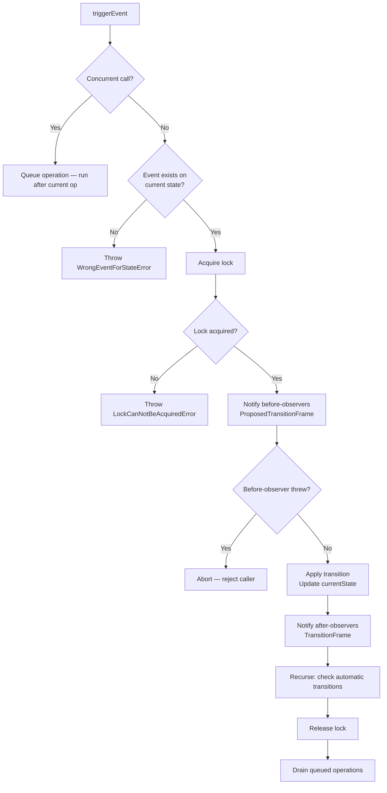

# Core

The core module contains the fundamental building blocks of the state machine: states, transitions, events, processes, and the state machine itself. In v3, graph construction is routed through `ProcessBuilder`, which produces frozen `Process`/`State`/`Transition` instances.

## Table of Contents

- [ProcessBuilder](#processbuilder)
- [State](#state)
- [Transition](#transition)
- [Event](#event)
- [Process](#process)
- [Statemachine](#statemachine)

---

## ProcessBuilder

**Import:** `import { ProcessBuilder } from '@camcima/finita'`

The entry point for defining a workflow graph. Collects states and transitions, validates the graph, and produces a frozen `Process`.

### Constructor

```typescript
new ProcessBuilder<TSubject = unknown>(processName: string)
```

| Parameter     | Type     | Description      |
| ------------- | -------- | ---------------- |
| `processName` | `string` | The process name |

### Methods

| Method                              | Return Type | Description                                                    |
| ----------------------------------- | ----------- | -------------------------------------------------------------- |
| `addState(name, options?)`          | `this`      | Declares a state. Pass `{ initial: true }` for the start state |
| `addTransition(from, to, options?)` | `this`      | Declares a directed edge between two declared states           |
| `build(options?)`                   | `Process`   | Validates and freezes the graph. May only be called once.      |

### `addState` options

| Option     | Type                      | Default | Description                              |
| ---------- | ------------------------- | ------- | ---------------------------------------- |
| `initial`  | `boolean`                 | `false` | Marks this state as the initial state    |
| `metadata` | `Record<string, unknown>` | `{}`    | Key-value metadata attached to the state |

### `addTransition` options

| Option      | Type                           | Default | Description                                         |
| ----------- | ------------------------------ | ------- | --------------------------------------------------- |
| `event`     | `string`                       | —       | The event name that triggers this transition        |
| `condition` | `ConditionInterface<TSubject>` | `null`  | Guard condition                                     |
| `weight`    | `number`                       | `1`     | Priority weight used by `WeightTransition` selector |

### `build` options

| Option          | Type      | Default | Description                                                  |
| --------------- | --------- | ------- | ------------------------------------------------------------ |
| `strictOrphans` | `boolean` | `false` | When `true`, unreachable states throw `GraphValidationError` |

### Errors thrown

- `ProcessFinalizedError` — `build()` called more than once on the same builder
- `GraphValidationError` — missing initial state, multiple initial states, unknown transition endpoint, empty event name, orphan state (strict mode)
- `DuplicateTransitionError` — two transitions with the same `(from, event, to)` identity but conflicting condition objects
- `DuplicateStateError` — `addState` called with an already-declared name

### Example

```typescript
import { ProcessBuilder } from "@camcima/finita";

const process = new ProcessBuilder("order-workflow")
  .addState("draft", { initial: true })
  .addState("review")
  .addState("published")
  .addState("archived")
  .addTransition("draft", "review", { event: "submit" })
  .addTransition("review", "published", { event: "approve" })
  .addTransition("review", "draft", { event: "reject" })
  .addTransition("published", "archived", { event: "archive" })
  .build();
```

---

## State

**Import:** `import type { StateInterface } from '@camcima/finita'`

A state represents a named node in the workflow graph. In v3, states are constructed exclusively by `ProcessBuilder` and are frozen after creation. You interact with states through `StateInterface`.

### Methods

| Method                  | Return Type                     | Description                             |
| ----------------------- | ------------------------------- | --------------------------------------- |
| `getName()`             | `string`                        | Returns the state name                  |
| `getTransitions()`      | `Iterable<TransitionInterface>` | Returns all outgoing transitions        |
| `hasEvent(name)`        | `boolean`                       | Checks if an event exists on this state |
| `getEvent(name)`        | `EventInterface`                | Returns the event with the given name   |
| `getEventNames()`       | `string[]`                      | Returns the names of all events         |
| `getMetadata()`         | `Record<string, unknown>`       | Returns all metadata as a plain object  |
| `getMetadataValue(key)` | `unknown`                       | Returns the value for a metadata key    |
| `hasMetadataValue(key)` | `boolean`                       | Checks if a metadata key exists         |

### Key Behaviors

- **Frozen after construction:** State objects are immutable. `addTransition`, `setMetadataValue`, and `deleteMetadataValue` no longer exist; use the builder to declare these at construction time.
- **Events:** Events on a state correspond to the event names of transitions that leave from that state. They are pre-baked by the builder.

### Example

```typescript
import { ProcessBuilder } from "@camcima/finita";

const process = new ProcessBuilder("example")
  .addState("open", { initial: true, metadata: { color: "green" } })
  .addState("closed")
  .addTransition("open", "closed", { event: "close" })
  .addTransition("closed", "open", { event: "open" })
  .build();

const openState = process.getState("open");
console.log(openState.hasEvent("close")); // true
console.log(openState.getEventNames()); // ['close']
console.log(openState.getMetadataValue("color")); // 'green'
```

---

## Transition

**Import:** `import type { TransitionInterface } from '@camcima/finita'`

A transition represents a directed edge from one state to another. In v3, transitions are constructed exclusively by `ProcessBuilder` and are frozen.

### Methods

| Method                               | Return Type                            | Description                                                 |
| ------------------------------------ | -------------------------------------- | ----------------------------------------------------------- |
| `getTargetState()`                   | `StateInterface`                       | Returns the target state                                    |
| `getEventName()`                     | `string \| null`                       | Returns the event name, or `null` for automatic transitions |
| `getConditionName()`                 | `string \| null`                       | Returns the condition name, or `null` if no condition       |
| `getCondition()`                     | `ConditionInterface<TSubject> \| null` | Returns the condition object                                |
| `isActive(subject, context, event?)` | `Promise<boolean>`                     | Determines if this transition is currently active           |
| `getWeight()`                        | `number`                               | Returns the weight                                          |

### How `isActive()` Works

A transition is active when **both** of these are true:

1. **Event match:** If an `event` is provided, the event name must match the transition's event name. If no `event` is provided, the transition must be automatic (`eventName === null`).
2. **Condition check:** If the transition has a condition, it must return `true`.

### Types of Transitions

#### Event-Based Transition

Triggered explicitly by calling `statemachine.triggerEvent()`.

```typescript
const process = new ProcessBuilder("example")
  .addState("pending", { initial: true })
  .addState("approved")
  .addTransition("pending", "approved", { event: "approve" })
  .build();
```

#### Automatic Transition

Has no event name. Fires automatically when its condition is true, checked by `statemachine.checkTransitions()`.

```typescript
import { CallbackCondition, ProcessBuilder } from "@camcima/finita";

const isExpired = new CallbackCondition("isExpired", (subject) =>
  subject.isExpired(),
);

const process = new ProcessBuilder("subscription")
  .addState("active", { initial: true })
  .addState("expired")
  .addTransition("active", "expired", { condition: isExpired })
  .build();
```

#### Conditional Event Transition

Triggered by an event, but only if the condition is also true.

```typescript
import { CallbackCondition, ProcessBuilder } from "@camcima/finita";

const canApprove = new CallbackCondition(
  "hasPermission",
  (subject) => subject.canApprove,
);

const process = new ProcessBuilder("review")
  .addState("pending", { initial: true })
  .addState("approved")
  .addTransition("pending", "approved", {
    event: "approve",
    condition: canApprove,
  })
  .build();
```

### Weight

Transitions have a weight (default: `1`) used by the `WeightTransition` selector. Set it via `addTransition({ weight })`:

```typescript
const process = new ProcessBuilder("example")
  .addState("pending", { initial: true })
  .addState("vip-approved")
  .addState("standard-approved")
  .addTransition("pending", "vip-approved", {
    event: "approve",
    condition: isVip,
    weight: 10,
  })
  .addTransition("pending", "standard-approved", {
    event: "approve",
    condition: isNotVip,
    weight: 1,
  })
  .build();
```

---

## Event

**Import:** `import { Event } from '@camcima/finita'`

An event is a named trigger that notifies attached observers when invoked. Events implement the Observer pattern and carry invoke arguments and metadata.

### Constructor

```typescript
new Event(name: string)
```

### Methods

| Method                         | Return Type               | Description                                                                                            |
| ------------------------------ | ------------------------- | ------------------------------------------------------------------------------------------------------ |
| `getName()`                    | `string`                  | Returns the event name                                                                                 |
| `invoke(...args)`              | `Promise<void>`           | Notifies all observers, passing args directly to each `Observer.update` call                           |
| `getInvokeArgs()`              | `unknown[]`               | **Deprecated.** Always returns `[]`. Read args from the `args` parameter of `Observer.update` instead. |
| `attach(observer)`             | `void`                    | Adds an observer                                                                                       |
| `detach(observer)`             | `void`                    | Removes an observer                                                                                    |
| `notify(args?)`                | `Promise<void>`           | Notifies all attached observers, passing `args` to each `update` call                                  |
| `getObservers()`               | `Iterable<Observer>`      | Returns all attached observers                                                                         |
| `getMetadata()`                | `Record<string, unknown>` | Returns all metadata                                                                                   |
| `getMetadataValue(key)`        | `unknown`                 | Returns metadata value                                                                                 |
| `setMetadataValue(key, value)` | `void`                    | Sets metadata value                                                                                    |
| `hasMetadataValue(key)`        | `boolean`                 | Checks if metadata key exists                                                                          |
| `deleteMetadataValue(key)`     | `void`                    | Removes metadata key                                                                                   |

### Invoke Flow

When `invoke()` is called:

1. `notify(args)` is called, iterating over all observers
2. Each observer's `update(event, args)` is awaited sequentially — observers receive the arguments as the second `args` parameter
3. After all observers complete, the call resolves

> **Note:** `event.getInvokeArgs()` is **deprecated** and always returns `[]`. Custom `Observer` implementations should read invoke arguments from the `args` parameter of `update(subject, args)` instead.

> **`invoke()` vs `notify()` with no args:** `invoke()` always supplies a concrete array, so `event.invoke()` delivers `args = []` (an explicit zero-argument call). A bare `event.notify()` supplies no array, so observers receive `args = undefined` — letting them distinguish "invoked with zero args" from "no args supplied" (e.g. `CallbackObserver` routes the latter to its legacy `update(subject)` path).

### Example

```typescript
import { ProcessBuilder, CallbackObserver } from "@camcima/finita";

const process = new ProcessBuilder("article")
  .addState("draft", { initial: true })
  .addState("published")
  .addTransition("draft", "published", { event: "publish" })
  .build();

// Attach an observer to the 'publish' event on the 'draft' state
process
  .getState("draft")
  .getEvent("publish")
  .attach(
    new CallbackObserver((subject, context) => {
      console.log("Send welcome email to", subject.email);
    }),
  );
```

---

## Process

**Import:** `import type { ProcessInterface } from '@camcima/finita'`

A process defines a complete workflow as a named, frozen collection of states. In v3, processes are created exclusively by `ProcessBuilder.build()`.

### Methods

| Method              | Return Type                | Description               |
| ------------------- | -------------------------- | ------------------------- |
| `getName()`         | `string`                   | Returns the process name  |
| `getInitialState()` | `StateInterface`           | Returns the initial state |
| `getStates()`       | `Iterable<StateInterface>` | Returns all states        |
| `getState(name)`    | `StateInterface`           | Returns a state by name   |
| `hasState(name)`    | `boolean`                  | Checks if a state exists  |

### Immutability

A `Process` is **immutable after construction**. All states and transitions are frozen by the builder.

### Example

```typescript
import { ProcessBuilder } from "@camcima/finita";

const process = new ProcessBuilder("workflow")
  .addState("s1", { initial: true })
  .addState("s2")
  .addState("s3")
  .addTransition("s1", "s2", { event: "next" })
  .addTransition("s2", "s3", { event: "next" })
  .build();

console.log(process.hasState("s1")); // true
console.log(process.hasState("s2")); // true
console.log(process.hasState("s3")); // true
```

---

## Statemachine

**Import:** `import { Statemachine } from '@camcima/finita'`

The state machine is the runtime orchestrator. It tracks the current state, processes events, evaluates conditions, manages locks, and notifies observers.

### Constructor

```typescript
new Statemachine<TSubject = unknown>(
  subject: TSubject,
  process: ProcessInterface,
  options?: StatemachineOptions<TSubject>
)
```

| Parameter | Type                            | Description                                                     |
| --------- | ------------------------------- | --------------------------------------------------------------- |
| `subject` | `TSubject`                      | The domain object being managed (e.g., an Order, Article, etc.) |
| `process` | `ProcessInterface`              | The process defining the workflow                               |
| `options` | `StatemachineOptions<TSubject>` | Optional configuration object (see below)                       |

### `StatemachineOptions`

| Option               | Type                                    | Default                               | Description                                                  |
| -------------------- | --------------------------------------- | ------------------------------------- | ------------------------------------------------------------ |
| `initialStateName`   | `string`                                | `process.getInitialState().getName()` | Override the starting state                                  |
| `transitionSelector` | `TransitionSelectorInterface<TSubject>` | `new OneOrNoneActiveTransition()`     | Strategy for selecting among active transitions              |
| `mutex`              | `MutexInterface`                        | `new NullMutex()`                     | Mutex for concurrency control                                |
| `autoreleaseLock`    | `boolean`                               | `true`                                | When `true`, lock is released after each top-level operation |

### Methods

| Method                         | Return Type              | Description                                         |
| ------------------------------ | ------------------------ | --------------------------------------------------- |
| `getCurrentState()`            | `StateInterface`         | Returns the current state                           |
| `getLastState()`               | `StateInterface \| null` | Returns the state before the most recent transition |
| `getSubject()`                 | `TSubject`               | Returns the managed subject                         |
| `getProcess()`                 | `ProcessInterface`       | Returns the process                                 |
| `triggerEvent(name, context?)` | `Promise<void>`          | Triggers a named event on the current state         |
| `checkTransitions(context?)`   | `Promise<void>`          | Evaluates automatic transitions                     |
| `acquireLock()`                | `Promise<boolean>`       | Manually acquires the lock                          |
| `releaseLock()`                | `Promise<void>`          | Manually releases the lock                          |
| `isLockAcquired()`             | `boolean`                | Checks if the lock is currently acquired            |
| `isAutoreleaseLock()`          | `boolean`                | Checks if auto-release is enabled                   |
| `setAutoreleaseLock(value)`    | `void`                   | Enables/disables auto-release                       |
| `attachBefore(observer)`       | `void`                   | Attaches a `BeforeTransitionObserver`               |
| `attachAfter(observer)`        | `void`                   | Attaches an `AfterTransitionObserver`               |

### Event Processing Flow

When `triggerEvent(name, context?)` is called:


```mermaid
flowchart TD
    A[triggerEvent] --> B{Concurrent call?}
    B -- Yes --> C[Queue operation — run after current op]
    B -- No --> D{Event exists on\ncurrent state?}
    D -- No --> E[Throw WrongEventForStateError]
    D -- Yes --> F[Acquire lock]
    F --> G{Lock acquired?}
    G -- No --> H[Throw LockCanNotBeAcquiredError]
    G -- Yes --> I[Notify before-observers\nProposedTransitionFrame]
    I --> J{Before-observer threw?}
    J -- Yes --> K[Abort — reject caller]
    J -- No --> L[Apply transition\nUpdate currentState]
    L --> M[Notify after-observers\nTransitionFrame]
    M --> N[Recurse: check automatic transitions]
    N --> O[Release lock]
    O --> P[Drain queued operations]
```

1. If a concurrent call arrives it is queued and runs after the current top-level operation completes
2. `triggerEvent()` validates the event exists on the current state
3. The lock is acquired (throws `LockCanNotBeAcquiredError` if it fails)
4. Before-observers receive a `ProposedTransitionFrame`; throwing aborts the transition
5. The state changes and after-observers receive a frozen `TransitionFrame`
6. Automatic transitions are checked recursively from the new state
7. The lock is auto-released (if `autoreleaseLock` is `true`)

### Observers

State machine observers are attached via `attachBefore` and `attachAfter`:

- **`BeforeTransitionObserver`** — runs before a transition commits; throwing vetoes the transition
- **`AfterTransitionObserver`** — runs after a transition commits; receives a frozen `TransitionFrame` plus an `EnqueueContext` for safely chaining events

```typescript
import type {
  AfterTransitionObserver,
  TransitionFrame,
  EnqueueContext,
} from "@camcima/finita";

class AuditObserver implements AfterTransitionObserver {
  notify(frame: TransitionFrame, ctx: EnqueueContext): void {
    console.log(`${frame.fromState.getName()} → ${frame.toState.getName()}`);
  }
}

const sm = new Statemachine(subject, process);
sm.attachAfter(new AuditObserver());
```

### Concurrency

Concurrent calls to `triggerEvent` and `checkTransitions` on the same instance are automatically serialized into a FIFO queue. There is no longer any "already running" error for same-instance concurrency.

### Lock Management

By default, the state machine uses a `NullMutex` which always succeeds. For concurrency control across processes, pass a `MutexInterface` implementation via options.

```typescript
const sm = new Statemachine(subject, process, { mutex: myMutex });

// Auto-release (default): lock is released after each triggerEvent/checkTransitions
// Manual lock management:
const sm2 = new Statemachine(subject, process, {
  mutex: myMutex,
  autoreleaseLock: false,
});
await sm2.acquireLock();
await sm2.triggerEvent("step1");
await sm2.triggerEvent("step2");
await sm2.releaseLock();
```

### Typed Usage

```typescript
import {
  ProcessBuilder,
  Statemachine,
  CallbackCondition,
} from "@camcima/finita";

interface Order {
  id: number;
  total: number;
  status: string;
}

const canApprove = new CallbackCondition<Order>(
  "canApprove",
  (order) => order.total <= 1000, // order is typed as Order -- no cast needed
);

const process = new ProcessBuilder<Order>("order")
  .addState("pending", { initial: true })
  .addState("approved")
  .addTransition("pending", "approved", {
    event: "review",
    condition: canApprove,
  })
  .build();

const order: Order = { id: 1, total: 500, status: "pending" };
const sm = new Statemachine<Order>(order, process);

const subject = sm.getSubject(); // typed as Order
console.log(subject.total); // 500 -- no cast needed
```
