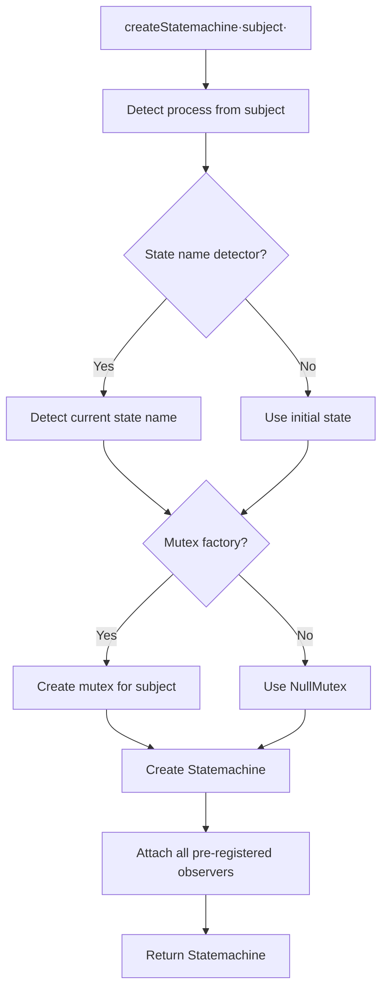

# Factory

The factory module provides a pattern for creating pre-configured state machines from subject objects. It separates the concern of "how to create a state machine" from the domain logic that uses it.

## Table of Contents

- [Factory](#factory)
- [SingleProcessDetector](#singleprocessdetector)
- [AbstractNamedProcessDetector](#abstractnamedprocessdetector)
- [StatefulStateNameDetector](#statefulstatenamedetector)
- [Complete Example](#complete-example)

---

## Factory

**Import:** `import { Factory } from '@camcima/finita'`

The main factory class. Creates `Statemachine` instances by detecting the process and optionally the current state from the subject.

### What It Does

When `createStatemachine(subject)` is called:



1. Detects the process using the `ProcessDetectorInterface`
2. Detects the current state name using `StateNameDetectorInterface` (if provided)
3. Creates a `MutexInterface` using `MutexFactoryInterface` (if provided)
4. Creates the `Statemachine` with all components
5. Attaches all pre-registered observers

### Constructor

```typescript
new Factory<TSubject = unknown>(
  processDetector: ProcessDetectorInterface<TSubject>,
  stateNameDetector?: StateNameDetectorInterface<TSubject> | null
)
```

| Parameter           | Type                                          | Default    | Description                                                               |
| ------------------- | --------------------------------------------- | ---------- | ------------------------------------------------------------------------- |
| `processDetector`   | `ProcessDetectorInterface<TSubject>`          | (required) | Determines which process to use for the subject                           |
| `stateNameDetector` | `StateNameDetectorInterface<TSubject> \| null` | `null`     | Detects the current state from the subject (for restoring state machines) |

### Methods

| Method                                 | Return Type                      | Description                                                    |
| -------------------------------------- | -------------------------------- | -------------------------------------------------------------- |
| `createStatemachine(subject)`          | `Promise<StatemachineInterface<TSubject>>` | Creates a fully configured state machine for the subject       |
| `setMutexFactory(factory)`             | `void`                           | Sets the mutex factory for concurrency control                 |
| `setTransitionSelector(selector)`      | `void`                           | Sets the transition selector strategy                          |
| `attachStatemachineObserver(observer)` | `void`                           | Registers an observer to attach to every created state machine |
| `detachStatemachineObserver(observer)` | `void`                           | Unregisters an observer                                        |
| `getStatemachineObservers()`           | `Iterable<Observer>`             | Returns all registered observers                               |

### Example

```typescript
import {
  Factory,
  SingleProcessDetector,
  StatefulStateNameDetector,
  StatefulStatusChanger,
  TransitionLogger,
  ScoreTransition,
} from "@camcima/finita";

const factory = new Factory(
  new SingleProcessDetector(orderProcess),
  new StatefulStateNameDetector(), // Restore state from subject
);

// Configure
factory.setTransitionSelector(new ScoreTransition());
factory.attachStatemachineObserver(new StatefulStatusChanger());
factory.attachStatemachineObserver(new TransitionLogger(logger));

// Create state machines -- all configuration is applied automatically
const sm1 = await factory.createStatemachine(order1);
const sm2 = await factory.createStatemachine(order2);
```

---

## SingleProcessDetector

**Import:** `import { SingleProcessDetector } from '@camcima/finita'`

A process detector that always returns the same process, regardless of the subject.

### What It Does

Always returns the process passed in the constructor. Use this when all subjects follow the same workflow.

### Constructor

```typescript
new SingleProcessDetector(process: ProcessInterface)
```

### Methods

| Method                   | Return Type        | Description                           |
| ------------------------ | ------------------ | ------------------------------------- |
| `detectProcess(subject)` | `ProcessInterface` | Always returns the configured process |

### Example

```typescript
import { SingleProcessDetector, Factory } from "@camcima/finita";

const detector = new SingleProcessDetector(orderProcess);
const factory = new Factory(detector);
```

---

## AbstractNamedProcessDetector

**Import:** `import { AbstractNamedProcessDetector } from '@camcima/finita'`

An abstract base class for process detectors that select a process by name from a registry. Subclasses implement the logic to extract the process name from the subject.

### What It Does

Maintains a `Map<string, ProcessInterface>` of named processes. When `detectProcess()` is called, it asks the subclass for the process name, then looks it up in the registry.

### Constructor

```typescript
// Abstract -- must be subclassed
constructor();
```

### Methods

| Method                   | Return Type        | Description                                               |
| ------------------------ | ------------------ | --------------------------------------------------------- |
| `addProcess(process)`    | `void`             | Registers a process (keyed by `process.getName()`)        |
| `hasProcess(name)`       | `boolean`          | Checks if a process name is registered                    |
| `detectProcess(subject)` | `ProcessInterface` | Detects the process name from the subject and looks it up |

### Abstract Method

```typescript
protected abstract detectProcessName(subject: TSubject): string;
```

Subclasses must implement this to extract the process name from the subject.

### Example

```typescript
import { AbstractNamedProcessDetector } from '@camcima/finita';

interface Order {
  paymentType: string;
}

class OrderProcessDetector extends AbstractNamedProcessDetector<Order> {
  protected detectProcessName(subject: Order): string {
    return subject.paymentType; // 'prepayment' or 'postpayment' -- no cast needed
  }
}

const detector = new OrderProcessDetector();
detector.addProcess(prepaymentProcess);  // name: 'prepayment'
detector.addProcess(postpaymentProcess); // name: 'postpayment'

const factory = new Factory(detector);

// Creates a state machine with the prepayment process
const sm = await factory.createStatemachine({ paymentType: 'prepayment', ... });
```

---

## StatefulStateNameDetector

**Import:** `import { StatefulStateNameDetector } from '@camcima/finita'`

Detects the current state name from subjects that implement `StatefulInterface`.

### What It Does

Checks if the subject has a `getCurrentStateName()` method. If yes, returns the state name. If not, throws an `Error`.

### Constructor

```typescript
new StatefulStateNameDetector();
```

### Methods

| Method                            | Return Type      | Description                                     |
| --------------------------------- | ---------------- | ----------------------------------------------- |
| `detectCurrentStateName(subject)` | `string \| null` | Returns the current state name from the subject |

### Required Subject Interface

```typescript
interface StatefulInterface {
  getCurrentStateName(): string;
  setCurrentStateName(name: string): void;
}
```

### When to Use

Use this when subjects persist their current state (e.g., in a database column) and you need to restore the state machine to the correct state.

### Example

```typescript
import {
  StatefulStateNameDetector,
  Factory,
  SingleProcessDetector,
} from "@camcima/finita";

class Order {
  status: string;

  getCurrentStateName(): string {
    return this.status;
  }

  setCurrentStateName(name: string): void {
    this.status = name;
  }
}

const factory = new Factory(
  new SingleProcessDetector(orderProcess),
  new StatefulStateNameDetector(), // Reads order.status to set initial state
);

// If order.status is 'shipped', the state machine starts at the 'shipped' state
const order = loadOrderFromDatabase(); // { status: 'shipped', ... }
const sm = await factory.createStatemachine(order);
console.log(sm.getCurrentState().getName()); // 'shipped'
```

---

## Complete Example

Putting it all together -- a production-ready factory setup with typed generics:

```typescript
import {
  State,
  Transition,
  Process,
  Factory,
  SingleProcessDetector,
  StatefulStateNameDetector,
  StatefulStatusChanger,
  OnEnterObserver,
  TransitionLogger,
  ScoreTransition,
  MutexFactory,
  CallbackCondition,
  CallbackObserver,
} from "@camcima/finita";
import type {
  LoggerInterface,
  LockAdapterInterface,
  StatefulInterface,
} from "@camcima/finita";

interface Article extends StatefulInterface {
  id: number;
  submittedAt: Date | null;
  status: string;
}

// 1. Define the process
const draft = new State("draft");
const review = new State("review");
const published = new State("published");
const archived = new State("archived");

draft.addTransition(new Transition(review, "submit"));
review.addTransition(new Transition(published, "approve"));
review.addTransition(new Transition(draft, "reject"));
published.addTransition(new Transition(archived, "archive"));

// Attach commands
draft.getEvent("submit").attach(
  new CallbackObserver((subject) => {
    (subject as Article).submittedAt = new Date();
  }),
);

const articleProcess = new Process("article-workflow", draft);

// 2. Set up the factory with typed generics
const factory = new Factory<Article>(
  new SingleProcessDetector<Article>(articleProcess),
  new StatefulStateNameDetector(), // Reads article.status to set initial state
);

factory.setTransitionSelector(new ScoreTransition<Article>());

// 3. Register observers
factory.attachStatemachineObserver(new StatefulStatusChanger());
factory.attachStatemachineObserver(new OnEnterObserver());
factory.attachStatemachineObserver(new TransitionLogger(logger));

// 4. Optionally add locking -- subject is typed, no cast needed
factory.setMutexFactory(
  new MutexFactory<Article>(
    lockAdapter,
    (article) => `article:${article.id}`,
  ),
);

// 5. Use the factory -- returns StatemachineInterface<Article>
async function getStatemachine(article: Article) {
  return factory.createStatemachine(article);
}

// Create or restore state machines for any article
const sm = await getStatemachine(articleFromDatabase);
const subject = sm.getSubject(); // typed as Article
await sm.triggerEvent("approve");
```
