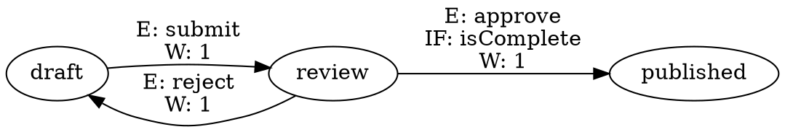
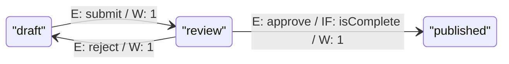

# Graph Visualization

The graph module builds a plain data structure representing the state machine as a directed graph, with built-in methods to export DOT (GraphViz) and Mermaid formats. The raw graph data is also available for custom rendering with D3.js or any other visualization tool.

## Table of Contents

- [GraphBuilder](#graphbuilder)
- [Data Types](#data-types)
- [Rendering with GraphViz](#rendering-with-graphviz)
- [Rendering with Mermaid](#rendering-with-mermaid)

---

## GraphBuilder

**Import:** `import { GraphBuilder } from 'finita'`

Builds a `Graph` data structure from states and their transitions.

### What It Does

Iterates over states and their transitions to produce:

- **Nodes:** One per unique state, with the state name as both `id` and `label`
- **Edges:** One per transition, with a label describing the event, commands, condition, and weight

### Constructor

```typescript
new GraphBuilder();
```

### Methods

| Method                           | Return Type | Description                                                             |
| -------------------------------- | ----------- | ----------------------------------------------------------------------- |
| `addState(state)`                | `void`      | Adds a state and all its transitions to the graph                       |
| `addStates(states)`              | `void`      | Adds multiple states                                                    |
| `addStateCollection(collection)` | `void`      | Adds all states from a `StateCollectionInterface` (including `Process`) |
| `getGraph()`                     | `Graph`     | Returns the built graph data structure                                  |
| `toDot(options?)`                | `string`    | Returns the graph as a DOT (GraphViz) string                            |
| `toMermaid(options?)`            | `string`    | Returns the graph as a Mermaid stateDiagram string                      |

### Edge Labels

Each edge label includes relevant transition metadata:

```
E: eventName        (if the transition has an event)
C: observer1, ...   (if the event has observers/commands)
IF: conditionName   (if the transition has a condition)
W: weight           (always included)
```

### Example

```typescript
import {
  GraphBuilder,
  State,
  Transition,
  Process,
  CallbackCondition,
} from "finita";

const draft = new State("draft");
const review = new State("review");
const published = new State("published");

const isComplete = new CallbackCondition("isComplete", () => true);
draft.addTransition(new Transition(review, "submit"));
review.addTransition(new Transition(published, "approve", isComplete));
review.addTransition(new Transition(draft, "reject"));

const builder = new GraphBuilder();
builder.addState(draft);
builder.addState(review);
builder.addState(published);

const graph = builder.getGraph();

console.log(
  "Nodes:",
  graph.nodes.map((n) => n.id),
);
// ['draft', 'review', 'published']

for (const edge of graph.edges) {
  console.log(`${edge.source} -> ${edge.target}: ${edge.label}`);
}
// draft -> review: E: submit\nW: 1
// review -> published: E: approve\nIF: isComplete\nW: 1
// review -> draft: E: reject\nW: 1
```

### Using with a Process

```typescript
const process = new Process("workflow", draft);
const builder = new GraphBuilder();
builder.addStateCollection(process);
const graph = builder.getGraph();
```

### Duplicate Prevention

Adding the same state twice (by name) does not create duplicate nodes. Transitions are always added.

---

## Data Types

### `Graph`

```typescript
interface Graph {
  nodes: GraphNode[];
  edges: GraphEdge[];
}
```

### `GraphNode`

```typescript
interface GraphNode {
  id: string; // State name
  label: string; // Display label (same as id by default)
  metadata: Record<string, unknown>; // State metadata
}
```

### `GraphEdge`

```typescript
interface GraphEdge {
  source: string; // Source state name
  target: string; // Target state name
  label: string; // Formatted label with event/condition/weight info
  metadata: Record<string, unknown>; // Event metadata (if the transition has an event)
}
```

**Import types:** `import type { Graph, GraphNode, GraphEdge } from 'finita'`

---

## Rendering with GraphViz (DOT)

Use the built-in `toDot()` method to produce DOT format output:

```typescript
const builder = new GraphBuilder();
builder.addStateCollection(process);

const dot = builder.toDot();
// Save to file and render: dot -Tsvg workflow.dot -o workflow.svg
```

### DotOptions

| Option    | Type     | Default | Description                                                           |
| --------- | -------- | ------- | --------------------------------------------------------------------- |
| `rankdir` | `string` | `'LR'`  | Graph direction: `'LR'` (left-to-right), `'TB'` (top-to-bottom), etc. |

```typescript
// Top-to-bottom layout
const dot = builder.toDot({ rankdir: "TB" });
```

Example output:



**Import types:** `import type { DotOptions } from 'finita'`

---

## Rendering with Mermaid

Use the built-in `toMermaid()` method to produce Mermaid stateDiagram syntax:

```typescript
const builder = new GraphBuilder();
builder.addStateCollection(process);

const mermaid = builder.toMermaid();
```

### MermaidOptions

| Option      | Type     | Default | Description                                       |
| ----------- | -------- | ------- | ------------------------------------------------- |
| `direction` | `string` | `'LR'`  | Diagram direction: `'LR'`, `'TB'`, `'RL'`, `'BT'` |

```typescript
// Top-to-bottom layout
const mermaid = builder.toMermaid({ direction: "TB" });
```

Multiline edge labels (event, condition, weight) are joined with `/` for single-line display.

Example output:



**Import types:** `import type { MermaidOptions } from 'finita'`

---

## Custom Rendering

For other visualization tools (D3.js, Cytoscape, etc.), use `getGraph()` to access the raw data:

```typescript
const graph = builder.getGraph();

for (const node of graph.nodes) {
  // node.id, node.label, node.metadata
}

for (const edge of graph.edges) {
  // edge.source, edge.target, edge.label, edge.metadata
}
```
