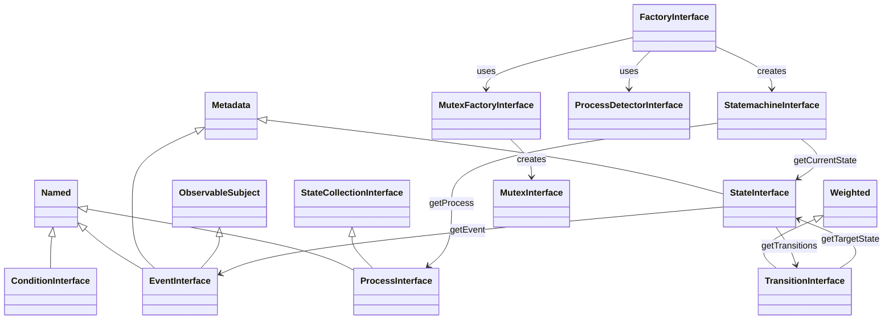

# Interfaces

All TypeScript interfaces exported by the library. These can be used to create custom implementations of any component.

**Import:** `import type { InterfaceName } from '@camcima/finita'`


```mermaid
classDiagram
    direction TB

    Named <|-- EventInterface
    Named <|-- ConditionInterface
    Named <|-- ProcessInterface
    Metadata <|-- EventInterface
    Metadata <|-- StateInterface
    Weighted <|-- TransitionInterface
    ObservableSubject <|-- EventInterface

    StateCollectionInterface <|-- ProcessInterface

    StateInterface --> TransitionInterface : getTransitions
    StateInterface --> EventInterface : getEvent
    TransitionInterface --> StateInterface : getTargetState
    StatemachineInterface --> ProcessInterface : getProcess
    StatemachineInterface --> StateInterface : getCurrentState

    FactoryInterface --> StatemachineInterface : creates
    FactoryInterface --> ProcessDetectorInterface : uses
    FactoryInterface --> MutexFactoryInterface : uses
    MutexFactoryInterface --> MutexInterface : creates
```

## Table of Contents

- [MaybePromise Type](#maybepromise-type)
- [Base Interfaces](#base-interfaces)
- [Core Interfaces](#core-interfaces)
- [Observer Interfaces](#observer-interfaces)
- [Condition Interface](#condition-interface)
- [Factory Interfaces](#factory-interfaces)
- [Mutex Interfaces](#mutex-interfaces)
- [Dispatcher Interfaces](#dispatcher-interfaces) _(deprecated)_
- [Utility Interfaces](#utility-interfaces)

> **Import all types:** `import type { InterfaceName } from '@camcima/finita'`

---

## MaybePromise Type

A utility type used throughout the library to indicate that a method may return either a synchronous value or a `Promise`.

```typescript
type MaybePromise<T> = T | Promise<T>;
```

Methods that return `MaybePromise<T>` can be implemented synchronously (returning `T` directly) or asynchronously (returning `Promise<T>`). The library handles both cases internally.

---

## Base Interfaces

### Named

An object with a name.

```typescript
interface Named {
  getName(): string;
}
```

Used by: `StateInterface`, `EventInterface`, `ConditionInterface`, `ProcessInterface`

### Metadata

An object with key-value metadata.

```typescript
interface Metadata {
  getMetadata(): Record<string, unknown>;
}
```

Used by: `StateInterface`, `EventInterface`

### Weighted

An object with a numeric weight.

```typescript
interface Weighted {
  getWeight(): number;
}
```

Used by: `TransitionInterface`

---

## Core Interfaces

### EventInterface

```typescript
interface EventInterface extends Named, Metadata, ObservableSubject {
  /** @deprecated Always returns []. Read args from Observer.update's args parameter. */
  getInvokeArgs(): unknown[];
  invoke(...args: unknown[]): Promise<void>;
  getMetadataValue(key: string): unknown;
  setMetadataValue(key: string, value: unknown): void;
  hasMetadataValue(key: string): boolean;
  deleteMetadataValue(key: string): void;
}
```

### StateInterface

```typescript
interface StateInterface extends Named, Metadata {
  getTransitions(): Iterable<TransitionInterface>;
  getEventNames(): string[];
  hasEvent(name: string): boolean;
  getEvent(name: string): EventInterface;
  getMetadataValue(key: string): unknown;
  hasMetadataValue(key: string): boolean;
}
```

> **v3:** `addTransition`, `setMetadataValue`, and `deleteMetadataValue` are no longer on `StateInterface`. Declare these at graph construction time through `ProcessBuilder`.

### TransitionInterface

```typescript
interface TransitionInterface<TSubject = unknown> extends Weighted {
  getTargetState(): StateInterface;
  getEventName(): string | null;
  getConditionName(): string | null;
  getCondition(): ConditionInterface<TSubject> | null;
  isActive(
    subject: TSubject,
    context: Map<string, unknown>,
    event?: EventInterface,
  ): Promise<boolean>;
}
```

### StateCollectionInterface

A read-only interface for accessing states in a collection.

```typescript
interface StateCollectionInterface {
  getStates(): Iterable<StateInterface>;
  getState(name: string): StateInterface;
  hasState(name: string): boolean;
}
```

> **v3:** `StateCollection` is an internal implementation detail. Use `ProcessInterface` (which extends `StateCollectionInterface`) to access states.

### ProcessInterface

```typescript
interface ProcessInterface extends Named, StateCollectionInterface {
  getInitialState(): StateInterface;
}
```

Note: `ProcessInterface` extends both `Named` and `StateCollectionInterface`. A `Process` is immutable after construction -- all states are discovered automatically from the initial state's transition graph.

### StatemachineInterface

```typescript
interface StatemachineInterface<TSubject = unknown> {
  getCurrentState(): StateInterface;
  getSubject(): TSubject;
  getProcess(): ProcessInterface;
  getLastState(): StateInterface | null;
  triggerEvent(name: string, context?: Map<string, unknown>): Promise<void>;
  checkTransitions(context?: Map<string, unknown>): Promise<void>;
  acquireLock(): Promise<boolean>;
  releaseLock(): Promise<void>;
  isLockAcquired(): boolean;
  isAutoreleaseLock(): boolean;
  setAutoreleaseLock(autorelease: boolean): void;
  attachBefore(observer: BeforeTransitionObserver<TSubject>): void;
  attachAfter(observer: AfterTransitionObserver<TSubject>): void;
}
```

> **v3:** `getSelectedTransition()`, `getCurrentContext()`, `attach()`, `detach()`, `notify()`, and `getObservers()` are removed. Read transition/context data from the `TransitionFrame` inside an observer. Use `attachBefore`/`attachAfter` instead of `attach`.

---

## Observer Interfaces

### Observer

Used for **event observers** — attached to `Event` objects on a state.

```typescript
interface Observer {
  /**
   * @param args The arguments the notification was invoked with — for
   * Statemachine events, [subject, context]. Passed per-call so shared
   * Event instances carry no per-invocation state.
   */
  update(
    subject: ObservableSubject,
    args?: readonly unknown[],
  ): MaybePromise<void>;
}
```

> **v3 change:** The `args` parameter was added so invoke arguments are passed directly to each observer rather than stored on the shared `Event` instance. The `Event.getInvokeArgs()` method is deprecated and always returns `[]`.

### ObservableSubject

```typescript
interface ObservableSubject {
  attach(observer: Observer): void;
  detach(observer: Observer): void;
  notify(args?: readonly unknown[]): Promise<void>;
  getObservers(): Iterable<Observer>;
}
```

### BeforeTransitionObserver

Runs before a transition commits. Throwing aborts the transition.

```typescript
interface BeforeTransitionObserver<TSubject = unknown> {
  notify(frame: ProposedTransitionFrame<TSubject>): MaybePromise<void>;
}
```

### AfterTransitionObserver

Runs after a transition commits. Throwing does not roll back state.

```typescript
interface AfterTransitionObserver<TSubject = unknown> {
  notify(
    frame: TransitionFrame<TSubject>,
    ctx: EnqueueContext,
  ): MaybePromise<void>;
}
```

### EnqueueContext

```typescript
interface EnqueueContext {
  /**
   * @param ifStateName When provided, the enqueued event is silently skipped
   * unless the machine is still in that state when the operation is dequeued.
   */
  enqueue(
    event: string,
    context?: Map<string, unknown>,
    ifStateName?: string,
  ): void;
}
```

### TransitionFrame / ProposedTransitionFrame

```typescript
interface TransitionFrame<TSubject = unknown> {
  /** The subject this machine drives — identifies whose transition this is. */
  readonly subject: TSubject;
  readonly fromState: StateInterface;
  readonly toState: StateInterface;
  readonly transition: TransitionInterface<TSubject>;
  readonly event: EventInterface | null;
  readonly condition: ConditionInterface<TSubject> | null;
  readonly context: ReadonlyMap<string, unknown>;
  readonly timestamp: number;
  readonly machineName: string | null;
}

// ProposedTransitionFrame is a type alias for TransitionFrame — used in
// before-observers. toState is the proposed target; currentState is still
// fromState at call time.
type ProposedTransitionFrame<TSubject = unknown> = TransitionFrame<TSubject>;
```

> **v3 change:** `subject` was added to `TransitionFrame`. Observers can now identify and write to the correct machine subject directly from the frame, enabling `StatefulStatusChanger` to be registered on a `Factory` without pinning a specific subject.

---

## Condition Interface

### ConditionInterface

```typescript
interface ConditionInterface<TSubject = unknown> extends Named {
  checkCondition(
    subject: TSubject,
    context: Map<string, unknown>,
  ): MaybePromise<boolean>;
}
```

---

## Factory Interfaces

### FactoryInterface

```typescript
interface FactoryInterface<TSubject = unknown> {
  setMutexFactory(factory: MutexFactoryInterface<TSubject> | null): void;
  setTransitionSelector(selector: TransitionSelectorInterface<TSubject>): void;
  attachBeforeObserver(observer: BeforeTransitionObserver<TSubject>): void;
  detachBeforeObserver(observer: BeforeTransitionObserver<TSubject>): void;
  attachAfterObserver(observer: AfterTransitionObserver<TSubject>): void;
  detachAfterObserver(observer: AfterTransitionObserver<TSubject>): void;
  createStatemachine(
    subject: TSubject,
  ): Promise<StatemachineInterface<TSubject>>;
}
```

### ProcessDetectorInterface

```typescript
interface ProcessDetectorInterface<TSubject = unknown> {
  detectProcess(subject: TSubject): ProcessInterface;
}
```

### StateNameDetectorInterface

```typescript
interface StateNameDetectorInterface<TSubject = unknown> {
  detectCurrentStateName(subject: TSubject): string | null;
}
```

### TransitionSelectorInterface

```typescript
interface TransitionSelectorInterface<TSubject = unknown> {
  selectTransition(
    transitions: Iterable<TransitionInterface<TSubject>>,
  ): TransitionInterface<TSubject> | null;
}
```

### StatefulInterface

Implemented by subjects that persist their current state name.

```typescript
interface StatefulInterface {
  getCurrentStateName(): string;
  setCurrentStateName(name: string): void;
}
```

### LastStateHasChangedDateInterface

Implemented by subjects that track when their state last changed. Required by the `Timeout` condition.

```typescript
interface LastStateHasChangedDateInterface {
  getLastStateHasChangedDate(): Date;
}
```

---

## Mutex Interfaces

### MutexInterface

```typescript
interface MutexInterface {
  acquireLock(): MaybePromise<boolean>;
  releaseLock(): MaybePromise<boolean>;
  isAcquired(): boolean;
  isLocked(): MaybePromise<boolean>;
}
```

### MutexFactoryInterface

```typescript
interface MutexFactoryInterface<TSubject = unknown> {
  createMutex(subject: TSubject): MaybePromise<MutexInterface>;
}
```

### LockAdapterInterface

```typescript
interface LockAdapterInterface {
  acquireLock(resourceName: string): MaybePromise<boolean>;
  releaseLock(resourceName: string): MaybePromise<boolean>;
  isLocked(resourceName: string): MaybePromise<boolean>;
}
```

---

## Dispatcher Interfaces

> **Deprecated.** `DispatcherInterface` and `CallbackInterface` are kept for backward compatibility but are no longer used internally. The `Dispatcher` class has been removed. These types will be removed in v4.

### CallbackInterface

```typescript
/** @deprecated Will be removed in v4. */
interface CallbackInterface {
  invoke(): MaybePromise<void>;
}
```

### DispatcherInterface

```typescript
/** @deprecated Will be removed in v4. */
interface DispatcherInterface extends CallbackInterface {
  dispatch(event: EventInterface, args?: unknown[]): void;
  invoke(): Promise<void>;
}
```

---

## Utility Interfaces

### LoggerInterface

Compatible with common logging libraries (e.g., pino, winston).

```typescript
interface LoggerInterface {
  log(level: string, message: string, context?: Record<string, unknown>): void;
}
```
