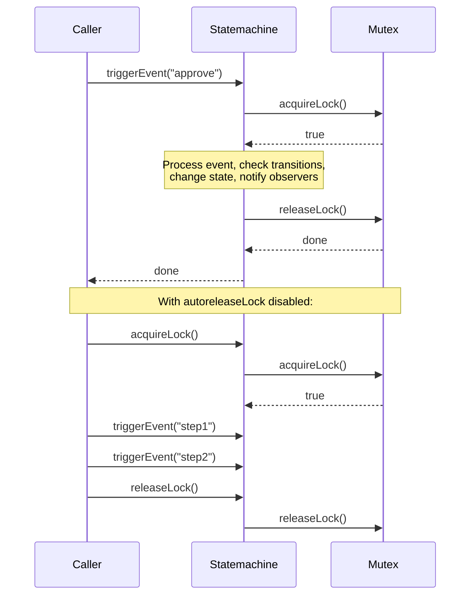

# Mutex / Locking

The mutex system provides concurrency control for the state machine. It prevents concurrent event processing from corrupting state.

All mutexes implement `MutexInterface`:

```typescript
import type { MaybePromise } from "finita";
// MaybePromise<T> = T | Promise<T>

interface MutexInterface {
  acquireLock(): MaybePromise<boolean>;
  releaseLock(): MaybePromise<boolean>;
  isAcquired(): boolean;
  isLocked(): MaybePromise<boolean>;
}
```

## Table of Contents

- [NullMutex](#nullmutex)
- [LockAdapterMutex](#lockadaptermutex)
- [MutexFactory](#mutexfactory)
- [LockAdapterInterface](#lockadapterinterface)
- [Custom Lock Adapters](#custom-lock-adapters)

---

## NullMutex

**Import:** `import { NullMutex } from 'finita'`

A no-op mutex that always succeeds. This is the default mutex used by the state machine.

### What It Does

- `acquireLock()` always returns `true` (returns `boolean` directly, which satisfies `MaybePromise<boolean>`)
- `releaseLock()` always returns `true` (returns `boolean` directly)
- `isLocked()` always returns `false` (returns `boolean` directly)
- Tracks acquired state locally (but has no actual locking mechanism)

### Constructor

```typescript
new NullMutex();
```

### When to Use

- Single-threaded environments
- When you don't need concurrency control
- During development and testing

This is the default -- you don't need to specify it:

```typescript
// Both are equivalent:
const sm = new Statemachine(subject, process);
const sm = new Statemachine(subject, process, null, null, new NullMutex());
```

---

## LockAdapterMutex

**Import:** `import { LockAdapterMutex } from 'finita'`

A mutex that delegates to a `LockAdapterInterface` implementation with a named resource. This allows plugging in distributed locking mechanisms (Redis, database locks, etc.).

### What It Does

- Delegates `acquireLock()`, `releaseLock()`, and `isLocked()` to the lock adapter using a resource name
- Tracks local acquired state to prevent redundant lock operations
- Won't re-acquire if already acquired
- Won't release if not acquired

### Constructor

```typescript
new LockAdapterMutex(lockAdapter: LockAdapterInterface, resourceName: string)
```

| Parameter      | Type                   | Description                                       |
| -------------- | ---------------------- | ------------------------------------------------- |
| `lockAdapter`  | `LockAdapterInterface` | The underlying lock mechanism                     |
| `resourceName` | `string`               | A unique identifier for the resource being locked |

### Methods

| Method          | Returns            | Behavior                                                                                                             |
| --------------- | ------------------ | -------------------------------------------------------------------------------------------------------------------- |
| `acquireLock()` | `Promise<boolean>` | If not already acquired, delegates to `lockAdapter.acquireLock(resourceName)`. Returns result.                       |
| `releaseLock()` | `Promise<boolean>` | If acquired, delegates to `lockAdapter.releaseLock(resourceName)`. Returns result. If not acquired, returns `false`. |
| `isAcquired()`  | `boolean`          | Returns local acquired state                                                                                         |
| `isLocked()`    | `Promise<boolean>` | Delegates to `lockAdapter.isLocked(resourceName)`                                                                    |

### Example

```typescript
import { LockAdapterMutex, Statemachine } from "finita";
import type { LockAdapterInterface } from "finita";

// Simple in-memory lock adapter
class InMemoryLockAdapter implements LockAdapterInterface {
  private locks = new Set<string>();

  acquireLock(name: string): boolean {
    if (this.locks.has(name)) return false;
    this.locks.add(name);
    return true;
  }

  releaseLock(name: string): boolean {
    return this.locks.delete(name);
  }

  isLocked(name: string): boolean {
    return this.locks.has(name);
  }
}

const adapter = new InMemoryLockAdapter();
const mutex = new LockAdapterMutex(adapter, `order-${order.id}`);
const sm = new Statemachine(order, process, null, null, mutex);

// LockAdapterMutex methods are async:
const acquired = await mutex.acquireLock();
const locked = await mutex.isLocked();
await mutex.releaseLock();
```

---

## MutexFactory

**Import:** `import { MutexFactory } from 'finita'`

Creates `LockAdapterMutex` instances automatically from subject objects. Used with the `Factory` pattern to provide locking per subject.

### What It Does

Takes a lock adapter and a string converter function. When `createMutex(subject)` is called, it converts the subject to a resource name string and creates a `LockAdapterMutex` with that name.

### Constructor

```typescript
new MutexFactory(lockAdapter: LockAdapterInterface, stringConverter: StringConverter)
```

| Parameter         | Type                           | Description                                  |
| ----------------- | ------------------------------ | -------------------------------------------- |
| `lockAdapter`     | `LockAdapterInterface`         | The shared lock adapter                      |
| `stringConverter` | `(subject: unknown) => string` | Converts a subject to a unique resource name |

### Type: `StringConverter`

```typescript
type StringConverter = (subject: unknown) => string;
```

### Example

```typescript
import { MutexFactory, Factory, SingleProcessDetector } from "finita";

const lockAdapter = new RedisLockAdapter(redisClient);
const mutexFactory = new MutexFactory(
  lockAdapter,
  (subject) => `order:${(subject as Order).id}`,
);

const factory = new Factory(new SingleProcessDetector(process));
factory.setMutexFactory(mutexFactory);

// Each state machine gets its own mutex keyed to the subject
const sm = factory.createStatemachine(order);
```

---

## LockAdapterInterface

```typescript
import type { MaybePromise } from "finita";
// MaybePromise<T> = T | Promise<T>

interface LockAdapterInterface {
  acquireLock(resourceName: string): MaybePromise<boolean>;
  releaseLock(resourceName: string): MaybePromise<boolean>;
  isLocked(resourceName: string): MaybePromise<boolean>;
}
```

Implement this interface to plug in your own locking mechanism. Methods can return `boolean` directly for synchronous implementations or `Promise<boolean>` for asynchronous ones.

---

## Custom Lock Adapters

### Redis Lock Adapter

An async adapter that returns `Promise<boolean>`, which satisfies `MaybePromise<boolean>`:

```typescript
import type { LockAdapterInterface } from "finita";

class RedisLockAdapter implements LockAdapterInterface {
  constructor(private client: RedisClient) {}

  async acquireLock(name: string): Promise<boolean> {
    const result = await this.client.set(`lock:${name}`, "1", "NX", "EX", 30);
    return result !== null;
  }

  async releaseLock(name: string): Promise<boolean> {
    return (await this.client.del(`lock:${name}`)) > 0;
  }

  async isLocked(name: string): Promise<boolean> {
    return (await this.client.exists(`lock:${name}`)) > 0;
  }
}
```

### Database Lock Adapter

An async adapter using `Promise<boolean>`. Synchronous adapters that return `boolean` directly also work since `MaybePromise<boolean>` accepts both:

```typescript
class DatabaseLockAdapter implements LockAdapterInterface {
  constructor(private db: Database) {}

  async acquireLock(name: string): Promise<boolean> {
    try {
      await this.db.exec(`SELECT pg_advisory_lock(hashtext('${name}'))`);
      return true;
    } catch {
      return false;
    }
  }

  async releaseLock(name: string): Promise<boolean> {
    await this.db.exec(`SELECT pg_advisory_unlock(hashtext('${name}'))`);
    return true;
  }

  async isLocked(name: string): Promise<boolean> {
    // Check pg_locks or similar
    return false;
  }
}
```

---

## Lock Lifecycle

The lock is automatically acquired and released around each `triggerEvent()` or `checkTransitions()` call:



## Manual Lock Management

By default, the state machine acquires and releases the lock automatically around each `triggerEvent()` or `checkTransitions()` call. You can disable this for batch operations:

```typescript
const sm = new Statemachine(subject, process, null, null, mutex);

// Disable auto-release
sm.setAutoreleaseLock(false);

// Manual lock management
await sm.acquireLock();
await sm.triggerEvent("step1");
await sm.triggerEvent("step2");
await sm.triggerEvent("step3");
await sm.releaseLock();
```
