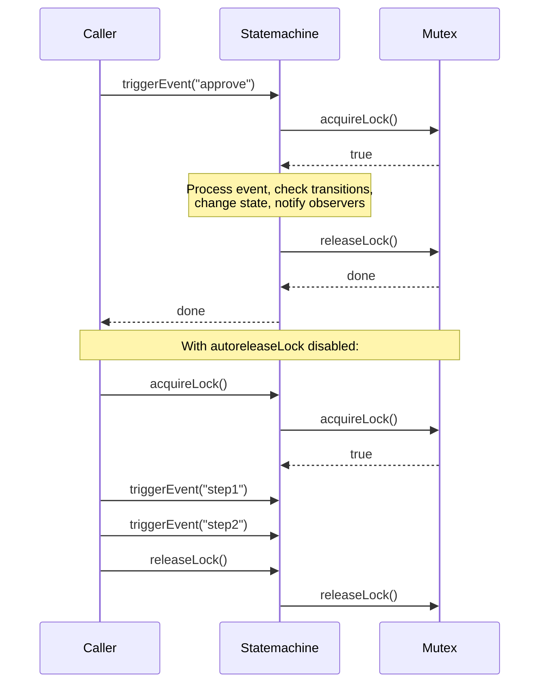

# Mutex / Locking

The mutex system provides concurrency control for the state machine. It prevents concurrent event processing from corrupting state.

All mutexes implement `MutexInterface`:

```typescript
import type { MaybePromise } from "@camcima/finita";
// MaybePromise<T> = T | Promise<T>

interface MutexInterface {
  acquireLock(): MaybePromise<boolean>;
  releaseLock(): MaybePromise<boolean>;
  isAcquired(): boolean;
  isLocked(): MaybePromise<boolean>;
}
```

## Table of Contents

- [NullMutex](#nullmutex)
- [LockAdapterMutex](#lockadaptermutex)
- [MutexFactory](#mutexfactory)
- [LockAdapterInterface](#lockadapterinterface)
- [Locks and persisted state](#locks-and-persisted-state)
- [Custom Lock Adapters](#custom-lock-adapters)

---

## NullMutex

**Import:** `import { NullMutex } from '@camcima/finita'`

A no-op mutex that always succeeds. This is the default mutex used by the state machine.

### What It Does

- `acquireLock()` always returns `true` (returns `boolean` directly, which satisfies `MaybePromise<boolean>`)
- `releaseLock()` always returns `true` (returns `boolean` directly)
- `isLocked()` always returns `false` (returns `boolean` directly)
- Tracks acquired state locally (but has no actual locking mechanism)

### Constructor

```typescript
new NullMutex();
```

### When to Use

- Single-threaded environments
- When you don't need concurrency control
- During development and testing

This is the default -- you don't need to specify it:

```typescript
// Both are equivalent:
const sm = new Statemachine(subject, process);
const sm = new Statemachine(subject, process, { mutex: new NullMutex() });
```

---

## LockAdapterMutex

**Import:** `import { LockAdapterMutex } from '@camcima/finita'`

A mutex that delegates to a `LockAdapterInterface` implementation with a named resource. This allows plugging in distributed locking mechanisms (Redis, database locks, etc.).

### What It Does

- Delegates `acquireLock()`, `releaseLock()`, and `isLocked()` to the lock adapter using a resource name
- Tracks local acquired state to prevent redundant lock operations
- Won't re-acquire if already acquired
- Won't release if not acquired

### Constructor

```typescript
new LockAdapterMutex(lockAdapter: LockAdapterInterface, resourceName: string)
```

| Parameter      | Type                   | Description                                       |
| -------------- | ---------------------- | ------------------------------------------------- |
| `lockAdapter`  | `LockAdapterInterface` | The underlying lock mechanism                     |
| `resourceName` | `string`               | A unique identifier for the resource being locked |

### Methods

| Method          | Returns            | Behavior                                                                                                                                                                                                                                   |
| --------------- | ------------------ | ------------------------------------------------------------------------------------------------------------------------------------------------------------------------------------------------------------------------------------------ |
| `acquireLock()` | `Promise<boolean>` | If not already acquired, delegates to `lockAdapter.acquireLock(resourceName)`. Returns result. Overlapping calls share one underlying acquire, so a non-idempotent adapter is never acquired twice; a failed acquire can still be retried. |
| `releaseLock()` | `Promise<boolean>` | If acquired, delegates to `lockAdapter.releaseLock(resourceName)`. Returns result. If not acquired, returns `false`.                                                                                                                       |
| `isAcquired()`  | `boolean`          | Returns local acquired state                                                                                                                                                                                                               |
| `isLocked()`    | `Promise<boolean>` | Delegates to `lockAdapter.isLocked(resourceName)`                                                                                                                                                                                          |

### Example

```typescript
import { LockAdapterMutex, Statemachine } from "@camcima/finita";
import type { LockAdapterInterface } from "@camcima/finita";

// Simple in-memory lock adapter
class InMemoryLockAdapter implements LockAdapterInterface {
  private locks = new Set<string>();

  acquireLock(name: string): boolean {
    if (this.locks.has(name)) return false;
    this.locks.add(name);
    return true;
  }

  releaseLock(name: string): boolean {
    return this.locks.delete(name);
  }

  isLocked(name: string): boolean {
    return this.locks.has(name);
  }
}

const adapter = new InMemoryLockAdapter();
const mutex = new LockAdapterMutex(adapter, `order-${order.id}`);
const sm = new Statemachine(order, process, { mutex });

// LockAdapterMutex methods are async:
const acquired = await mutex.acquireLock();
const locked = await mutex.isLocked();
await mutex.releaseLock();
```

---

## MutexFactory

**Import:** `import { MutexFactory } from '@camcima/finita'`

Creates `LockAdapterMutex` instances automatically from subject objects. Used with the `Factory` pattern to provide locking per subject.

### What It Does

Takes a lock adapter and a string converter function. When `createMutex(subject)` is called, it converts the subject to a resource name string and creates a `LockAdapterMutex` with that name.

### Constructor

```typescript
new MutexFactory(lockAdapter: LockAdapterInterface, stringConverter: StringConverter)
```

| Parameter         | Type                           | Description                                  |
| ----------------- | ------------------------------ | -------------------------------------------- |
| `lockAdapter`     | `LockAdapterInterface`         | The shared lock adapter                      |
| `stringConverter` | `(subject: unknown) => string` | Converts a subject to a unique resource name |

### Type: `StringConverter`

```typescript
type StringConverter = (subject: unknown) => string;
```

### Example

```typescript
import { MutexFactory, Factory, SingleProcessDetector } from "@camcima/finita";

const lockAdapter = new RedisLockAdapter(redisClient);
const mutexFactory = new MutexFactory(
  lockAdapter,
  (subject) => `order:${(subject as Order).id}`,
);

const factory = new Factory(new SingleProcessDetector(process));
factory.setMutexFactory(mutexFactory);

// Each state machine gets its own mutex keyed to the subject
const sm = factory.createStatemachine(order);
```

---

## LockAdapterInterface

```typescript
import type { MaybePromise } from "@camcima/finita";
// MaybePromise<T> = T | Promise<T>

interface LockAdapterInterface {
  acquireLock(resourceName: string): MaybePromise<boolean>;
  releaseLock(resourceName: string): MaybePromise<boolean>;
  isLocked(resourceName: string): MaybePromise<boolean>;
}
```

Implement this interface to plug in your own locking mechanism. Methods can return `boolean` directly for synchronous implementations or `Promise<boolean>` for asynchronous ones.

---

## One machine per mutex instance

A `MutexInterface` instance carries per-machine state: the engine treats
`isAcquired() === true` as "this machine already holds the lock" and skips
acquisition (this is what makes manual lock management with
`autoreleaseLock: false` possible). If you pass the same mutex instance to
two machines, the second machine silently piggybacks on the first machine's
lock and mutual exclusion is lost.

Always construct one mutex per machine — `MutexFactory` does this correctly.
Cross-machine exclusion comes from sharing the underlying
`LockAdapterInterface` (same resource name), never from sharing a mutex
object.

---

## Locks and persisted state

A lock serializes execution. It does not make a machine's state current.

A machine reads its subject's state once, when it is constructed, and keeps
it in memory. Acquiring the lock later does not reload that state. If two
machines are built from the same persisted record before either runs, both
start in the same state. Each takes the lock in turn, and both commit the
same transition, running its side effects twice. The same happens with a
long-lived machine whose record another worker has since changed.

Pick one ownership model and route every operation on a subject through it:

- **In memory, one owner.** A single long-lived machine owns the subject's
  state, and every operation goes through that machine. The machine's own
  queue serializes the operations, so no mutex is needed.
- **Persisted, loaded inside the lock.** Take the lock before loading the
  record, build the machine from what you loaded, trigger the event, persist
  the new state, and release the lock only after the write commits. The
  machine can use the default `NullMutex`, because the application already
  holds the lock around its whole lifetime.

```typescript
async function approve(orderId: string): Promise<void> {
  const resource = `order:${orderId}`;
  if (!(await locks.acquireLock(resource))) {
    throw new Error("order is busy; retry later");
  }
  try {
    const order = await orders.load(orderId); // fresh, inside the lock
    const sm = await factory.createStatemachine(order);
    await sm.triggerEvent("approve");
    await orders.save(order);
  } finally {
    await locks.releaseLock(resource);
  }
}
```

While the first worker holds the lock, a second `approve` for the same order
fails at once with the busy error. When it retries after the first worker
releases the lock, it loads the already-approved record, and its
`triggerEvent` rejects with `WrongEventForStateError` instead of approving
twice.

Two further safeguards are worth adding:

- **Check a version when persisting.** Write with a condition such as
  `WHERE version = ?`, or inside a transaction, so a stale write fails even
  if the locking is misconfigured or a lock lease expires.
- **Make external side effects idempotent.** After-observers run after the
  transition commits in memory, and nothing rolls them back if persisting
  fails later. Use idempotency keys, or record side effects in a
  transactional outbox that is written with the state.

---

## Custom Lock Adapters

### Redis Lock Adapter

An async adapter that returns `Promise<boolean>`, which satisfies `MaybePromise<boolean>`. It stores a per-adapter ownership token and releases only a lock it still owns (atomic compare-and-delete via a Lua script):

```typescript
import { randomUUID } from "node:crypto";
import type { LockAdapterInterface } from "@camcima/finita";

const RELEASE_SCRIPT = `
if redis.call("get", KEYS[1]) == ARGV[1] then
  return redis.call("del", KEYS[1])
else
  return 0
end
`;

class RedisLockAdapter implements LockAdapterInterface {
  private readonly token = randomUUID();

  constructor(private client: RedisClient) {}

  async acquireLock(name: string): Promise<boolean> {
    const result = await this.client.set(`lock:${name}`, this.token, "NX");
    return result !== null;
  }

  async releaseLock(name: string): Promise<boolean> {
    const deleted = await this.client.eval(
      RELEASE_SCRIPT,
      1,
      `lock:${name}`,
      this.token,
    );
    return deleted === 1;
  }

  async isLocked(name: string): Promise<boolean> {
    return (await this.client.exists(`lock:${name}`)) > 0;
  }
}
```

> **Warning — leases and TTLs:** `LockAdapterInterface` has no ownership
> token, renewal, or fencing support, so a TTL-based (leased) lock cannot be
> implemented safely through it: if an operation outlives the TTL, another
> worker acquires the lock, and an unconditional `DEL` would delete _that
> worker's_ lock, breaking mutual exclusion. The adapter above therefore
> keeps a per-adapter token, releases only its own lock, and does **not**
> set a TTL. The trade-off: if a process crashes while holding the lock, the
> lock must be cleared by operational tooling. True leases (TTL + renewal +
> fencing tokens) require a token-aware locking API and are planned for the
> next major version.

### Database Lock Adapter

An async adapter using `Promise<boolean>`. Synchronous adapters that return `boolean` directly also work since `MaybePromise<boolean>` accepts both. The example uses `pg_try_advisory_lock` (non-blocking, boolean-returning) so it matches the `acquireLock` contract, and parameterizes the lock name via the database driver — never interpolate a name into a SQL string:

```typescript
class DatabaseLockAdapter implements LockAdapterInterface {
  constructor(private db: Database) {}

  async acquireLock(name: string): Promise<boolean> {
    // pg_try_advisory_lock returns boolean: true if the lock was acquired
    // immediately, false if held by another session. Non-blocking — fits
    // the boolean acquireLock contract.
    const { rows } = await this.db.query(
      "SELECT pg_try_advisory_lock(hashtext($1)) AS locked",
      [name],
    );
    return rows[0].locked === true;
  }

  async releaseLock(name: string): Promise<boolean> {
    const { rows } = await this.db.query(
      "SELECT pg_advisory_unlock(hashtext($1)) AS released",
      [name],
    );
    return rows[0].released === true;
  }

  async isLocked(name: string): Promise<boolean> {
    // Advisory-lock visibility depends on your pg_locks query strategy
    // and concurrency model; pg_locks columns for advisory keys vary
    // by single- vs two-argument lock form. Stubbed here — implement
    // as your operations team requires (e.g. via a session bookkeeping
    // table).
    void name;
    return false;
  }
}
```

---

## Lock Lifecycle

The lock is automatically acquired and released around each `triggerEvent()` or `checkTransitions()` call:


```mermaid
sequenceDiagram
    participant Caller
    participant SM as Statemachine
    participant Mutex

    Caller->>SM: triggerEvent("approve")
    SM->>Mutex: acquireLock()
    Mutex-->>SM: true
    Note over SM: Process event, check transitions,<br/>change state, notify observers
    SM->>Mutex: releaseLock()
    Mutex-->>SM: done
    SM-->>Caller: done

    Note over Caller,Mutex: With autoreleaseLock disabled:
    Caller->>SM: acquireLock()
    SM->>Mutex: acquireLock()
    Mutex-->>SM: true
    Caller->>SM: triggerEvent("step1")
    Caller->>SM: triggerEvent("step2")
    Caller->>SM: releaseLock()
    SM->>Mutex: releaseLock()
```

## Release Error Behavior

A release fails in one of two ways, and the engine treats them identically: the mutex **throws**, or it **returns `false`** — the failure signal this interface defines (a PostgreSQL advisory unlock returning `false`, a Redis `DEL` that removed nothing).

When the automatic release fails:

- `onReleaseError` (in `StatemachineOptions`) is called with the error — a `LockCanNotBeReleasedError` for the `false` case;
- if the operation itself succeeded, the caller's promise **rejects**, because the lock may still be held. Silently resolving would let every later operation piggyback on a stuck lock and never release it (the engine skips acquisition whenever the mutex reports it is already held);
- if the operation itself failed, the caller's rejection carries the **operation** error, and `onReleaseError` is the only place the release failure appears.

`Statemachine.releaseLock()` (manual lock management) reports failures through `onReleaseError` but does not throw, preserving its `Promise<void>` contract; check `isLockAcquired()` to confirm the lock was actually freed.

### Uncertain ownership after a failed release

Reporting the failure is not enough to keep later work safe. A failed release leaves two possibilities the machine cannot tell apart:

- the unlock **never happened**, so the machine still holds the lock;
- the unlock **did happen** remotely but its reply was lost, so another worker may already hold the lock.

Operations used to keep running on the mutex's old "acquired" flag, skipping acquisition, and could therefore execute while another machine held the lock. Now, once releasing a held lock fails, every queued, chained, or later operation on that machine rejects with `LockOwnershipUncertainError` before it touches the mutex or runs any callback. The error's `cause` is the release failure. Chained operations report it through `onChainedOperationError`.

To recover:

1. Call `sm.releaseLock()`. If the release now succeeds, the machine resumes normal operation and the next operation acquires the lock afresh.
2. If it still fails, ownership cannot be confirmed. This is expected when the first unlock actually happened, because an ownership-checked unlock then removes nothing. Discard the machine and build a new one from persisted state, for example with `Factory.createStatemachine()`.

A manual `releaseLock()` of a lock the mutex does not claim to hold is still reported to `onReleaseError`, but it never blocks the machine, so defensive releases in `finally` blocks stay safe.

## Manual Lock Management

By default, the state machine acquires and releases the lock automatically around each `triggerEvent()` or `checkTransitions()` call. You can disable this for batch operations:

```typescript
const sm = new Statemachine(subject, process, {
  mutex,
  autoreleaseLock: false,
});

// Manual lock management
await sm.acquireLock();
await sm.triggerEvent("step1");
await sm.triggerEvent("step2");
await sm.triggerEvent("step3");
await sm.releaseLock();
```
