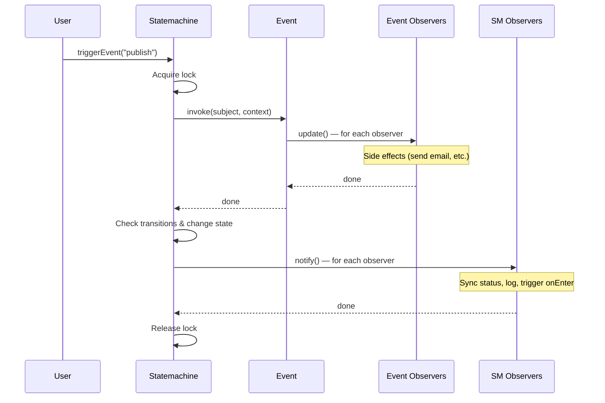
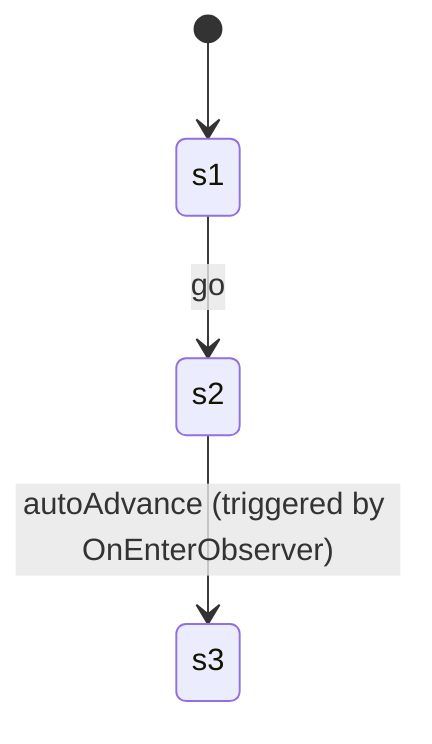

# Observers

Observers react to events or state changes. There are two contexts where observers are used:

1. **Event observers** -- attached to `Event` objects on a state. Fired when the event is invoked. They receive the subject and context as arguments.
2. **State machine observers** -- attached to the `Statemachine` itself. Fired on every state change. They receive the state machine as the subject.

All observers implement the `Observer` interface:

```typescript
import type { MaybePromise } from "@camcima/finita";

// MaybePromise<T> = T | Promise<T>

interface Observer {
  update(subject: ObservableSubject): MaybePromise<void>;
}
```

> **Note:** Synchronous observers that return `void` directly still work because `void` satisfies `MaybePromise<void>`.

## Observer Contexts

Events and the state machine are both observable subjects that notify observers at different points in the lifecycle:



## Table of Contents

- [CallbackObserver](#callbackobserver)
- [StatefulStatusChanger](#statefulstatuschanger)
- [OnEnterObserver](#onenterobserver)
- [TransitionLogger](#transitionlogger)
- [Custom Observers](#custom-observers)

---

## CallbackObserver

**Import:** `import { CallbackObserver } from '@camcima/finita'`

Wraps a plain function as an observer. This is the most common way to attach behavior to events.

### What It Does

When `update()` is called with an `EventInterface` subject, it extracts the invoke arguments and passes them to the callback. When called with a non-event subject, it passes the subject directly.

### Constructor

```typescript
new CallbackObserver(callback: (...args: unknown[]) => MaybePromise<void>)
```

| Parameter  | Type                                         | Description                                                                     |
| ---------- | -------------------------------------------- | ------------------------------------------------------------------------------- |
| `callback` | `(...args: unknown[]) => MaybePromise<void>` | The function to call. When attached to an event, receives `(subject, context)`. |

### How It Works

- If the subject has a `getInvokeArgs()` method (i.e., it's an `EventInterface`), the callback is called with the spread invoke args.
- Otherwise, the callback is called with the subject itself.

### Example: Event Observer

When attached to a state's event, the callback receives the **domain subject** and **context** (not the event object).

```typescript
import {
  State,
  Transition,
  CallbackObserver,
  Statemachine,
  Process,
} from "@camcima/finita";

const draft = new State("draft");
const published = new State("published");
draft.addTransition(new Transition(published, "publish"));

// Attach a command to the 'publish' event on the 'draft' state
draft.getEvent("publish").attach(
  new CallbackObserver((subject, context) => {
    const article = subject as Article;
    const ctx = context as Map<string, unknown>;
    article.publishedAt = new Date();
    console.log(`Article "${article.title}" published!`);
  }),
);

const process = new Process("article", draft);
const sm = new Statemachine(article, process);
await sm.triggerEvent("publish");
// Output: Article "Hello World" published!
```

### Example: State Machine Observer

When attached to the state machine, the callback receives the state machine itself.

```typescript
sm.attach(
  new CallbackObserver((statemachine) => {
    // This is NOT recommended for production -- use a dedicated Observer class instead.
    // CallbackObserver is designed for event attachment.
  }),
);
```

For state machine observation, use dedicated observer classes like `StatefulStatusChanger`, `OnEnterObserver`, or `TransitionLogger`.

---

## StatefulStatusChanger

**Import:** `import { StatefulStatusChanger } from '@camcima/finita'`

A state machine observer that synchronizes the current state name back to the subject. Designed for subjects that implement `StatefulInterface`.

### What It Does

On every state change, if the managed subject implements `StatefulInterface`, this observer calls `subject.setCurrentStateName()` with the new state name. This is useful for persisting state to a database or keeping the subject's status property in sync.

### Constructor

```typescript
new StatefulStatusChanger();
```

No parameters.

### Required Subject Interface

```typescript
interface StatefulInterface {
  getCurrentStateName(): string;
  setCurrentStateName(name: string): void;
}
```

### Example

```typescript
import {
  State,
  Transition,
  Process,
  Statemachine,
  StatefulStatusChanger,
} from "@camcima/finita";
import type { StatefulInterface } from "@camcima/finita";

class Order implements StatefulInterface {
  status = "new";

  getCurrentStateName(): string {
    return this.status;
  }

  setCurrentStateName(name: string): void {
    this.status = name;
    // Could also persist to database here
  }
}

const newState = new State("new");
const shipped = new State("shipped");
newState.addTransition(new Transition(shipped, "ship"));

const process = new Process("order", newState);
const order = new Order();
const sm = new Statemachine(order, process);
sm.attach(new StatefulStatusChanger());

console.log(order.status); // 'new'
await sm.triggerEvent("ship");
console.log(order.status); // 'shipped'
```

### When to Use

- You need the subject's status property to stay in sync with the state machine
- You want to persist state changes to a database through the subject's setter
- You're using the `Factory` pattern with `StatefulStateNameDetector` to restore state machines from persisted state

---

## OnEnterObserver

**Import:** `import { OnEnterObserver } from '@camcima/finita'`

A state machine observer that triggers a named event on the new state after every state change. This enables "on enter" behavior -- running commands automatically when a state is entered.

### What It Does

After each state change, this observer checks if the new state has an event with the configured name (default: `'onEnter'`). If it does, it triggers that event on the state machine, passing the current context.

### Constructor

```typescript
new OnEnterObserver(eventName?: string)
```

| Parameter   | Type     | Default     | Description                                |
| ----------- | -------- | ----------- | ------------------------------------------ |
| `eventName` | `string` | `'onEnter'` | The event name to trigger on the new state |

### How It Works

1. After a state change, `update()` is called with the state machine
2. It checks if `statemachine.getCurrentState().hasEvent(eventName)` is `true`
3. If yes, it temporarily disables autorelease lock (so the lock is held during the `onEnter` processing), triggers the event, then restores the autorelease setting

### Example: Running Commands on State Entry

```typescript
import {
  State,
  Transition,
  Process,
  Statemachine,
  CallbackObserver,
  OnEnterObserver,
} from "@camcima/finita";

const pending = new State("pending");
const approved = new State("approved");
pending.addTransition(new Transition(approved, "approve"));

// The 'onEnter' event needs a self-transition so the state machine can process it
approved.addTransition(new Transition(approved, "onEnter"));
approved.getEvent("onEnter").attach(
  new CallbackObserver((subject) => {
    console.log("Entered approved state! Sending notification...");
  }),
);

const process = new Process("review", pending);
const sm = new Statemachine({}, process);
sm.attach(new OnEnterObserver());

await sm.triggerEvent("approve");
// Output: Entered approved state! Sending notification...
```

### Example: Chaining State Changes

The `onEnter` event can itself trigger a transition, creating a chain of state changes:



```typescript
const s1 = new State("s1");
const s2 = new State("s2");
const s3 = new State("s3");

s1.addTransition(new Transition(s2, "go"));
s2.addTransition(new Transition(s3, "autoAdvance"));

const process = new Process("chain", s1);
const sm = new Statemachine({}, process);
sm.attach(new OnEnterObserver("autoAdvance"));

await sm.triggerEvent("go");
console.log(sm.getCurrentState().getName()); // 's3' -- auto-advanced!
```

### Custom Event Name

```typescript
// Use a custom event name instead of 'onEnter'
sm.attach(new OnEnterObserver("initialize"));
```

---

## TransitionLogger

**Import:** `import { TransitionLogger } from '@camcima/finita'`

A state machine observer that logs every state change to a `LoggerInterface`.

### What It Does

On every state change, it constructs a descriptive log message including the subject name, source state, target state, event name, and condition name. It passes this to the logger along with a context object.

### Constructor

```typescript
new TransitionLogger(logger: LoggerInterface, loggerLevel?: string)
```

| Parameter     | Type              | Default    | Description            |
| ------------- | ----------------- | ---------- | ---------------------- |
| `logger`      | `LoggerInterface` | (required) | The logger to write to |
| `loggerLevel` | `string`          | `'info'`   | The log level          |

### Required Interface

```typescript
interface LoggerInterface {
  log(level: string, message: string, context?: Record<string, unknown>): void;
}
```

This is compatible with common logging libraries. You can use any logger that has a `log(level, message, context?)` method, or create a simple adapter.

### Log Message Format

The message is built dynamically:

```
Transition for "{subjectName}" from "{lastStateName}" to "{currentStateName}" with event "{eventName}" condition "{conditionName}"
```

Parts are omitted if they are `null`:

- Subject name is extracted using the `Named` interface (`getName()`). If the subject doesn't implement `Named`, `String(subject)` is used.
- `from` is omitted if there is no last state
- `with event/condition` is omitted if the transition has no event or condition

### Context Object

The logger also receives a context object:

```typescript
{
  subject: unknown; // The managed subject
  currentState: State; // The new state
  lastState: State | null; // The previous state
  transition: Transition | null; // The selected transition
}
```

### Example

```typescript
import { TransitionLogger } from "@camcima/finita";
import type { LoggerInterface } from "@camcima/finita";

// Simple console logger
const logger: LoggerInterface = {
  log(level, message, context) {
    console.log(`[${level.toUpperCase()}] ${message}`);
  },
};

sm.attach(new TransitionLogger(logger));
await sm.triggerEvent("approve");
// Output: [INFO] Transition for "Order 123" from "pending" to "approved" with event "approve"
```

### Example: With a Logging Library

```typescript
import pino from "pino";

const pinoLogger = pino();
const logger: LoggerInterface = {
  log(level, message, context) {
    pinoLogger[level as "info"]({ ...context }, message);
  },
};

sm.attach(new TransitionLogger(logger));
```

---

## Custom Observers

### Event Observer

Attach behavior to specific events on specific states:

```typescript
import type {
  Observer,
  ObservableSubject,
  MaybePromise,
} from "@camcima/finita";
import type { EventInterface } from "@camcima/finita";

class SendEmailCommand implements Observer {
  update(subject: ObservableSubject): MaybePromise<void> {
    const event = subject as EventInterface;
    const [order, context] = event.getInvokeArgs() as [
      Order,
      Map<string, unknown>,
    ];
    sendEmail(order.customerEmail, "Your order has been shipped!");
  }
}

shippedState.getEvent("ship").attach(new SendEmailCommand());
```

### State Machine Observer

React to any state change:

```typescript
class AuditTrailObserver implements Observer {
  update(subject: ObservableSubject): MaybePromise<void> {
    const sm = subject as StatemachineInterface;
    auditLog.record({
      from: sm.getLastState()?.getName(),
      to: sm.getCurrentState().getName(),
      subject: sm.getSubject(),
      timestamp: new Date(),
    });
  }
}

sm.attach(new AuditTrailObserver());
```
