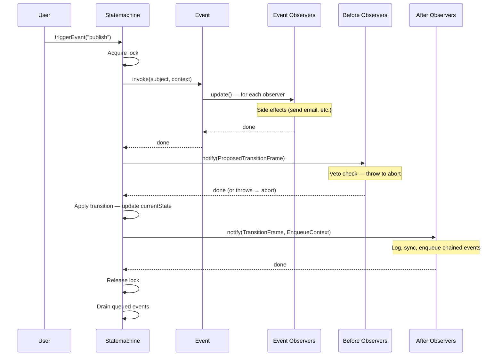
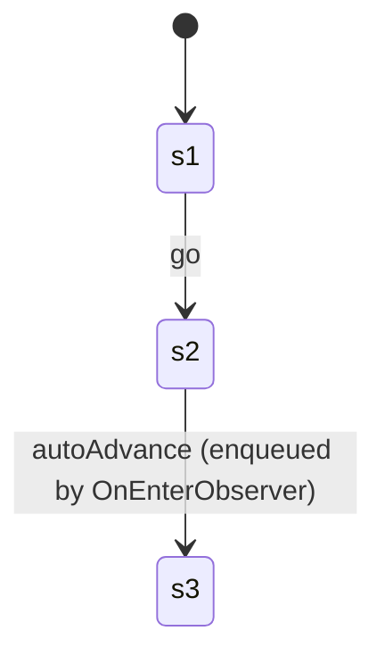

# Observers

Observers react to events or state changes. There are two contexts where observers are used:

1. **Event observers** — attached to `Event` objects on a state. Fired when the event is invoked. They receive the subject and context as arguments.
2. **State machine observers** — attached to the `Statemachine` itself. Fired on every state transition. In v3 there are two distinct observer interfaces with different contracts.

## Two-Phase Observer Model

v3 replaces the single `Observer.update(subject)` interface with two focused interfaces:

### `BeforeTransitionObserver`

Runs _before_ the state changes. Receives a `ProposedTransitionFrame` — the current state is still `fromState` at call time. **Throwing aborts the transition** — the state is not mutated and the caller's promise rejects with the thrown error.

```typescript
import type {
  BeforeTransitionObserver,
  ProposedTransitionFrame,
} from "@camcima/finita";

class PermissionGuard implements BeforeTransitionObserver {
  notify(frame: ProposedTransitionFrame): void {
    if (!currentUser.canTransitionTo(frame.toState.getName())) {
      throw new Error("Unauthorized transition");
    }
  }
}

sm.attachBefore(new PermissionGuard());
```

### `AfterTransitionObserver`

Runs _after_ the state has already changed. Receives a frozen `TransitionFrame` (state has moved to `toState`) and an `EnqueueContext`. **Throwing does not roll back the transition** — all after-observers are still invoked, and errors are reported to the caller after all have run. If multiple observers throw, a standard `AggregateError` is raised.

```typescript
import type {
  AfterTransitionObserver,
  TransitionFrame,
  EnqueueContext,
} from "@camcima/finita";

class AuditLogger implements AfterTransitionObserver {
  notify(frame: TransitionFrame, ctx: EnqueueContext): void {
    console.log(
      `[${frame.machineName}] ${frame.fromState.getName()} → ${frame.toState.getName()}`,
    );
  }
}

sm.attachAfter(new AuditLogger());
```

### `TransitionFrame`

Both observer interfaces receive a frame — an immutable snapshot of the transition. Its fields are:

| Field         | Type                           | Description                                      |
| ------------- | ------------------------------ | ------------------------------------------------ |
| `fromState`   | `StateInterface`               | The state before the transition                  |
| `toState`     | `StateInterface`               | The state after the transition                   |
| `transition`  | `TransitionInterface`          | The selected transition                          |
| `event`       | `EventInterface \| null`       | The triggering event (null for auto transitions) |
| `condition`   | `ConditionInterface \| null`   | The guard condition (null if none)               |
| `context`     | `ReadonlyMap<string, unknown>` | The context map passed to `triggerEvent`         |
| `timestamp`   | `number`                       | `Date.now()` at transition time                  |
| `machineName` | `string \| null`               | The process name                                 |

### `EnqueueContext`

The second argument to `AfterTransitionObserver.notify`. Allows safely chaining events without reentering the state machine:

```typescript
ctx.enqueue("nextEvent", new Map([["key", "value"]]));
```

`enqueue()` never runs inline — the event is appended to the FIFO queue and runs as its own top-level operation after the current operation (and all queued auto-follow-on transitions) completes.

## Observer Lifecycle


```mermaid
sequenceDiagram
    participant User
    participant SM as Statemachine
    participant Ev as Event
    participant EO as Event Observers
    participant BO as Before Observers
    participant AO as After Observers

    User->>SM: triggerEvent("publish")
    SM->>SM: Acquire lock
    SM->>Ev: invoke(subject, context)
    Ev->>EO: update() — for each observer
    Note over EO: Side effects (send email, etc.)
    EO-->>Ev: done
    Ev-->>SM: done
    SM->>BO: notify(ProposedTransitionFrame)
    Note over BO: Veto check — throw to abort
    BO-->>SM: done (or throws → abort)
    SM->>SM: Apply transition — update currentState
    SM->>AO: notify(TransitionFrame, EnqueueContext)
    Note over AO: Log, sync, enqueue chained events
    AO-->>SM: done
    SM->>SM: Release lock
    SM->>SM: Drain queued events
```

## Table of Contents

- [CallbackObserver](#callbackobserver)
- [StatefulStatusChanger](#statefulstatuschanger)
- [OnEnterObserver](#onenterobserver)
- [TransitionLogger](#transitionlogger)
- [Custom Observers](#custom-observers)

---

## CallbackObserver

**Import:** `import { CallbackObserver } from '@camcima/finita'`

Wraps a plain function as an event observer. This is the standard way to attach commands to state events.

### What It Does

When `update()` is called with an `EventInterface` subject, it extracts the invoke arguments and passes them to the callback. This is used for **event observers** (commands attached to a state's named event).

### Constructor

```typescript
new CallbackObserver(callback: (...args: unknown[]) => MaybePromise<void>)
```

| Parameter  | Type                                         | Description                                                                     |
| ---------- | -------------------------------------------- | ------------------------------------------------------------------------------- |
| `callback` | `(...args: unknown[]) => MaybePromise<void>` | The function to call. When attached to an event, receives `(subject, context)`. |

### Example: Event Observer

When attached to a state's event, the callback receives the **domain subject** and **context** (not the event object).

```typescript
import {
  ProcessBuilder,
  CallbackObserver,
  Statemachine,
} from "@camcima/finita";

const process = new ProcessBuilder("article")
  .addState("draft", { initial: true })
  .addState("published")
  .addTransition("draft", "published", { event: "publish" })
  .build();

// Attach a command to the 'publish' event on the 'draft' state
process
  .getState("draft")
  .getEvent("publish")
  .attach(
    new CallbackObserver((subject, context) => {
      const article = subject as Article;
      const ctx = context as Map<string, unknown>;
      article.publishedAt = new Date();
      console.log(`Article "${article.title}" published!`);
    }),
  );

const sm = new Statemachine(article, process);
await sm.triggerEvent("publish");
// Output: Article "Hello World" published!
```

---

## StatefulStatusChanger

**Import:** `import { StatefulStatusChanger } from '@camcima/finita'`

An `AfterTransitionObserver` that synchronizes the current state name back to the subject. Designed for subjects that implement `StatefulInterface`.

### What It Does

On every state change, this observer calls `subject.setCurrentStateName()` with the new state name. This is useful for persisting state to a database or keeping the subject's status property in sync.

### Constructor

```typescript
new StatefulStatusChanger<TSubject extends StatefulInterface>(subject?: TSubject)
```

| Parameter | Type                                 | Description                                                                                                                                                                                                                                              |
| --------- | ------------------------------------ | -------------------------------------------------------------------------------------------------------------------------------------------------------------------------------------------------------------------------------------------------------- |
| `subject` | `TSubject extends StatefulInterface` | Optional. When omitted (recommended with `Factory`), the observer writes to `frame.subject` — the subject of the machine that fired the transition. When provided, the observer always writes to this specific object regardless of which machine fired. |

### Required Subject Interface

```typescript
interface StatefulInterface {
  getCurrentStateName(): string;
  setCurrentStateName(name: string): void;
}
```

### Example

```typescript
import {
  ProcessBuilder,
  Statemachine,
  StatefulStatusChanger,
} from "@camcima/finita";
import type { StatefulInterface } from "@camcima/finita";

class Order implements StatefulInterface {
  status = "new";

  getCurrentStateName(): string {
    return this.status;
  }

  setCurrentStateName(name: string): void {
    this.status = name;
    // Could also persist to database here
  }
}

const process = new ProcessBuilder("order")
  .addState("new", { initial: true })
  .addState("shipped")
  .addTransition("new", "shipped", { event: "ship" })
  .build();

const order = new Order();
const sm = new Statemachine(order, process);
sm.attachAfter(new StatefulStatusChanger(order));

console.log(order.status); // 'new'
await sm.triggerEvent("ship");
console.log(order.status); // 'shipped'
```

### When to Use

- You need the subject's status property to stay in sync with the state machine
- You want to persist state changes to a database through the subject's setter
- **With `Factory` (recommended):** call `new StatefulStatusChanger()` with no argument and register it via `factory.attachAfterObserver(...)`. The observer writes to `frame.subject`, so one instance serves every machine the factory creates — each machine's transitions update its own subject.
- **Pinning a specific object:** call `new StatefulStatusChanger(subject)` with an explicit subject when you want all transitions (regardless of which machine fires them) to update that one object.

---

## OnEnterObserver

**Import:** `import { OnEnterObserver } from '@camcima/finita'`

An `AfterTransitionObserver` that **enqueues** a named event on the new state after every state change. This enables "on enter" behavior — running commands automatically when a state is entered.

### What It Does

After each state change, this observer checks if the new state has an event with the configured name (default: `'onEnter'`). If it does, it **enqueues** that event via `ctx.enqueue(...)`. The event runs as a separate top-level operation after the current operation completes — it does not execute inline.

### Constructor

```typescript
new OnEnterObserver(eventName?: string)
```

| Parameter   | Type     | Default     | Description                                |
| ----------- | -------- | ----------- | ------------------------------------------ |
| `eventName` | `string` | `'onEnter'` | The event name to trigger on the new state |

### How It Works

1. After a state change, `notify(frame, ctx)` is called
2. It checks if `frame.toState.hasEvent(eventName)` is `true`
3. If yes, it calls `ctx.enqueue(eventName, ...)` to schedule the event
4. The enqueued event runs after the current top-level operation drains

> **v3 behavior change:** In v2, `OnEnterObserver` ran the chained event inline (with potential reentrancy). In v3 it enqueues — observers registered after `OnEnterObserver` see the original transition's frame, not the chained one. The final state after the full queue drains is identical, but intermediate observer state differs.

### Example: Running Commands on State Entry

```typescript
import {
  ProcessBuilder,
  Statemachine,
  CallbackObserver,
  OnEnterObserver,
} from "@camcima/finita";

const process = new ProcessBuilder("review")
  .addState("pending", { initial: true })
  .addState("approved")
  .addTransition("pending", "approved", { event: "approve" })
  .addTransition("approved", "approved", { event: "onEnter" }) // self-transition for the onEnter event
  .build();

process
  .getState("approved")
  .getEvent("onEnter")
  .attach(
    new CallbackObserver((subject) => {
      console.log("Entered approved state! Sending notification...");
    }),
  );

const sm = new Statemachine({}, process);
sm.attachAfter(new OnEnterObserver());

await sm.triggerEvent("approve");
// After the full queue drains:
// Output: Entered approved state! Sending notification...
```

### Example: Chaining State Changes

The `onEnter` event can itself trigger a transition, creating a chain of state changes:


```mermaid
stateDiagram-v2
    [*] --> s1
    s1 --> s2 : go
    s2 --> s3 : autoAdvance (enqueued by OnEnterObserver)
```

```typescript
const process = new ProcessBuilder("chain")
  .addState("s1", { initial: true })
  .addState("s2")
  .addState("s3")
  .addTransition("s1", "s2", { event: "go" })
  .addTransition("s2", "s3", { event: "autoAdvance" })
  .build();

const sm = new Statemachine({}, process);
sm.attachAfter(new OnEnterObserver("autoAdvance"));

await sm.triggerEvent("go");
console.log(sm.getCurrentState().getName()); // 's3' -- auto-advanced via queue!
```

### Custom Event Name

```typescript
// Use a custom event name instead of 'onEnter'
sm.attachAfter(new OnEnterObserver("initialize"));
```

---

## TransitionLogger

**Import:** `import { TransitionLogger } from '@camcima/finita'`

An `AfterTransitionObserver` that logs every state change to a `LoggerInterface`.

### What It Does

On every state change, it constructs a descriptive log message including the source state, target state, event name, and condition name, reading these from the `TransitionFrame`. It passes this to the logger along with a context object.

### Constructor

```typescript
new TransitionLogger(logger: LoggerInterface, loggerLevel?: string)
```

| Parameter     | Type              | Default    | Description            |
| ------------- | ----------------- | ---------- | ---------------------- |
| `logger`      | `LoggerInterface` | (required) | The logger to write to |
| `loggerLevel` | `string`          | `'info'`   | The log level          |

### Required Interface

```typescript
interface LoggerInterface {
  log(level: string, message: string, context?: Record<string, unknown>): void;
}
```

This is compatible with common logging libraries. You can use any logger that has a `log(level, message, context?)` method, or create a simple adapter.

### Log Message Format

The message is built dynamically from the frame:

```
Transition from "{lastStateName}" to "{currentStateName}" with event "{eventName}" condition "{conditionName}"
```

Parts are omitted if they are `null`:

- `from` is omitted if there is no last state
- `with event/condition` is omitted if the transition has no event or condition

### Example

```typescript
import { TransitionLogger } from "@camcima/finita";
import type { LoggerInterface } from "@camcima/finita";

// Simple console logger
const logger: LoggerInterface = {
  log(level, message, context) {
    console.log(`[${level.toUpperCase()}] ${message}`);
  },
};

sm.attachAfter(new TransitionLogger(logger));
await sm.triggerEvent("approve");
// Output: [INFO] Transition from "pending" to "approved" with event "approve"
```

### Example: With a Logging Library

```typescript
import pino from "pino";

const pinoLogger = pino();
const logger: LoggerInterface = {
  log(level, message, context) {
    pinoLogger[level as "info"]({ ...context }, message);
  },
};

sm.attachAfter(new TransitionLogger(logger));
```

---

## Custom Observers

### Event Observer

Attach behavior to specific events on specific states (unchanged from v2):

```typescript
import type {
  Observer,
  ObservableSubject,
  MaybePromise,
} from "@camcima/finita";
import type { EventInterface } from "@camcima/finita";

class SendEmailCommand implements Observer {
  update(subject: ObservableSubject): MaybePromise<void> {
    const event = subject as EventInterface;
    const [order, context] = event.getInvokeArgs() as [
      Order,
      Map<string, unknown>,
    ];
    sendEmail(order.customerEmail, "Your order has been shipped!");
  }
}

process.getState("shipped").getEvent("ship").attach(new SendEmailCommand());
```

### State Machine Observer (After)

React to any state change using the frame parameter:

```typescript
import type {
  AfterTransitionObserver,
  TransitionFrame,
  EnqueueContext,
} from "@camcima/finita";

class AuditTrailObserver implements AfterTransitionObserver {
  notify(frame: TransitionFrame, ctx: EnqueueContext): void {
    auditLog.record({
      from: frame.fromState.getName(),
      to: frame.toState.getName(),
      timestamp: frame.timestamp,
    });
  }
}

sm.attachAfter(new AuditTrailObserver());
```

### State Machine Observer (Before)

Veto a transition before it commits:

```typescript
import type {
  BeforeTransitionObserver,
  ProposedTransitionFrame,
} from "@camcima/finita";

class FraudGuard implements BeforeTransitionObserver {
  notify(frame: ProposedTransitionFrame): void {
    if (isFraudulent(frame.context)) {
      throw new Error("Fraudulent transition blocked");
    }
  }
}

sm.attachBefore(new FraudGuard());
```
