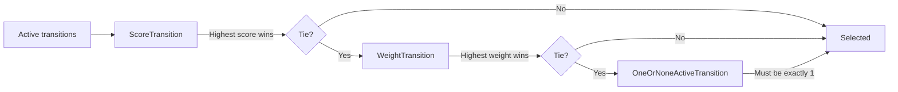

# Transition Selectors

When multiple transitions are active simultaneously, a transition selector determines which one to take. All selectors implement `TransitionSelectorInterface`:

```typescript
interface TransitionSelectorInterface {
  selectTransition(
    transitions: Iterable<TransitionInterface>,
  ): TransitionInterface | null;
}
```

Selectors receive the **already-filtered** list of active transitions and return a single winner (or `null` if no transitions are available).

## Table of Contents

- [OneOrNoneActiveTransition](#oneornoneactivetransition)
- [ScoreTransition](#scoretransition)
- [WeightTransition](#weighttransition)
- [Selector Chaining](#selector-chaining)
- [Custom Selectors](#custom-selectors)

---

## OneOrNoneActiveTransition

**Import:** `import { OneOrNoneActiveTransition } from 'finita'`

The simplest selector. Expects zero or one active transition. Throws if more than one is active.

### What It Does

- **0 transitions:** returns `null`
- **1 transition:** returns it
- **2+ transitions:** throws `Error('More than one transition is active!')`

This is the **default selector** used by `Statemachine` when no selector is specified.

### Constructor

```typescript
new OneOrNoneActiveTransition();
```

### When to Use

- Your state machine is designed so that at most one transition is active at any time
- You want strict validation that your workflow is unambiguous
- You want errors early if your workflow definition has overlapping transitions

### Example

```typescript
import { Statemachine, Process, State, Transition } from "finita";

// Default -- uses OneOrNoneActiveTransition
const sm = new Statemachine(subject, process);
```

---

## ScoreTransition

**Import:** `import { ScoreTransition } from 'finita'`

Selects the transition with the highest "specificity score". Prefers transitions that have more criteria (event name, condition) over bare transitions.

### What It Does

Calculates a score for each transition:

- Has an event name: **+2 points**
- Has a condition: **+1 point**

Selects the transition(s) with the highest score. If there's still a tie, delegates to the inner selector (default: `OneOrNoneActiveTransition`).

### Score Table

| Transition Type       | Event | Condition | Score |
| --------------------- | ----- | --------- | ----- |
| Bare automatic        | -     | -         | 0     |
| Conditional automatic | -     | yes       | 1     |
| Event-based           | yes   | -         | 2     |
| Conditional event     | yes   | yes       | 3     |

### Constructor

```typescript
new ScoreTransition(innerSelector?: TransitionSelectorInterface)
```

| Parameter       | Type                          | Default                           | Description                |
| --------------- | ----------------------------- | --------------------------------- | -------------------------- |
| `innerSelector` | `TransitionSelectorInterface` | `new OneOrNoneActiveTransition()` | Fallback selector for ties |

### When to Use

- You have states with both automatic and event-based transitions
- You want event-based transitions to take priority over automatic ones
- You want conditional transitions to take priority over unconditional ones

### Example

```typescript
import {
  ScoreTransition,
  Statemachine,
  Process,
  State,
  Transition,
  Tautology,
} from "finita";

const active = new State("active");
const expired = new State("expired");
const renewed = new State("renewed");

// Automatic transition (score 1): condition only
active.addTransition(new Transition(expired, null, new Tautology("isExpired")));
// Event transition (score 2): event only
active.addTransition(new Transition(renewed, "renew"));

const process = new Process("sub", active);
const sm = new Statemachine(subject, process, null, new ScoreTransition());

// When 'renew' is triggered, the event-based transition (score 2) wins
// over the automatic transition (score 1)
sm.triggerEvent("renew");
```

---

## WeightTransition

**Import:** `import { WeightTransition } from 'finita'`

Selects the transition with the highest weight. Transitions have a default weight of `1`, which can be changed with `setWeight()`.

### What It Does

Finds the transition(s) with the highest weight. Uses an epsilon tolerance (default: `0.001`) for floating-point comparison. If there's a tie, delegates to the inner selector.

### Constructor

```typescript
new WeightTransition(innerSelector?: TransitionSelectorInterface, epsilon?: number)
```

| Parameter       | Type                          | Default                           | Description                                    |
| --------------- | ----------------------------- | --------------------------------- | ---------------------------------------------- |
| `innerSelector` | `TransitionSelectorInterface` | `new OneOrNoneActiveTransition()` | Fallback for ties                              |
| `epsilon`       | `number`                      | `0.001`                           | Tolerance for floating-point weight comparison |

### When to Use

- You have multiple transitions from the same state for the same event
- You want to assign explicit priority to certain transitions
- You need fine-grained control over transition selection

### Example

```typescript
import {
  WeightTransition,
  Statemachine,
  State,
  Transition,
  CallbackCondition,
} from "finita";

const pending = new State("pending");
const vipApproved = new State("vip-approved");
const standardApproved = new State("standard-approved");

const isVip = new CallbackCondition("isVip", (s) => (s as any).vip);
const isNotVip = new CallbackCondition("isNotVip", (s) => !(s as any).vip);

const vipTransition = new Transition(vipApproved, "approve", isVip);
vipTransition.setWeight(10); // Higher priority

const standardTransition = new Transition(
  standardApproved,
  "approve",
  isNotVip,
);
standardTransition.setWeight(1);

pending.addTransition(vipTransition);
pending.addTransition(standardTransition);

const sm = new Statemachine(subject, process, null, new WeightTransition());
```

---

## Selector Chaining

Selectors can be nested. The outer selector filters first, then delegates ties to the inner selector:



```typescript
import { ScoreTransition, WeightTransition } from "finita";

// First select by score, then break ties by weight
const selector = new ScoreTransition(new WeightTransition());

const sm = new Statemachine(subject, process, null, selector);
```

---

## Custom Selectors

Implement `TransitionSelectorInterface` for custom selection logic:

```typescript
import type { TransitionSelectorInterface, TransitionInterface } from "finita";

class RandomTransition implements TransitionSelectorInterface {
  selectTransition(
    transitions: Iterable<TransitionInterface>,
  ): TransitionInterface | null {
    const arr = Array.from(transitions);
    if (arr.length === 0) return null;
    return arr[Math.floor(Math.random() * arr.length)];
  }
}
```
