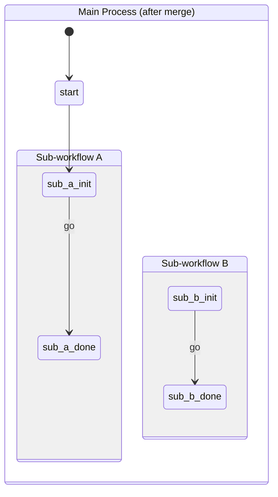

# Utilities

Utility classes for building and merging state machine definitions.

## Table of Contents

- [SetupHelper](#setuphelper)
- [StateCollectionMerger](#statecollectionmerger)

---

## SetupHelper

**Import:** `import { SetupHelper } from '@camcima/finita'`

A fluent helper for building state machine definitions from configuration data. Instead of manually creating `State` and `Transition` objects, the `SetupHelper` lets you define transitions by name and it handles object creation and deduplication.

### What It Does

Maintains a `StateCollection` and provides methods to:

- Find or create states by name
- Find or create transitions between named states
- Attach commands (observers) to state events
- Create self-transitions for command-only events

### Constructor

```typescript
new SetupHelper(stateCollection: StateCollection)
```

| Parameter         | Type              | Description                |
| ----------------- | ----------------- | -------------------------- |
| `stateCollection` | `StateCollection` | The collection to populate |

### Methods

| Method                                                       | Return Type           | Description                                                               |
| ------------------------------------------------------------ | --------------------- | ------------------------------------------------------------------------- |
| `findOrCreateState(name)`                                    | `StateInterface`      | Returns existing state or creates a new one                               |
| `findOrCreateTransition(source, target, event?, condition?)` | `TransitionInterface` | Returns existing transition or creates a new one                          |
| `findOrCreateEvent(source, eventName)`                       | `EventInterface`      | Returns the event on the source state (creates state and event on demand) |
| `addCommand(source, eventName, command)`                     | `void`                | Attaches an observer to a state's event                                   |
| `addCommandAndSelfTransition(source, eventName, command)`    | `void`                | Attaches a command AND creates a self-transition for the event            |

### Example: Building from Configuration

```typescript
import {
  SetupHelper,
  StateCollection,
  Process,
  CallbackObserver,
} from "@camcima/finita";

const collection = new StateCollection();
const helper = new SetupHelper(collection);

// Define transitions by name -- states are created automatically
helper.findOrCreateTransition("new", "pending", "submit");
helper.findOrCreateTransition("pending", "approved", "approve");
helper.findOrCreateTransition("pending", "rejected", "reject");
helper.findOrCreateTransition("approved", "published", "publish");

// Add commands to events
helper.addCommand(
  "new",
  "submit",
  new CallbackObserver((subject) => {
    console.log("Submitted!");
  }),
);

// Create the process from the initial state
const initial = collection.getState("new");
const process = new Process("workflow", initial);
```

### `findOrCreateTransition` Parameters

```typescript
findOrCreateTransition(
  sourceStateName: string,
  targetStateName: string,
  eventName?: string | null,     // null = automatic transition
  condition?: ConditionInterface | null
): TransitionInterface
```

If a transition already exists between the same source and target with the same event name and condition name, the existing transition is returned.

### `addCommandAndSelfTransition`

Creates a self-transition (from a state back to itself) and attaches the command. This is useful for events that should execute a command without changing state:

```typescript
// The 'calculate' event runs the command but stays in 'processing' state
helper.addCommandAndSelfTransition(
  "processing",
  "calculate",
  new CallbackObserver(() => {
    console.log("Calculation executed");
  }),
);
```

This creates:

1. A self-transition: `processing --calculate--> processing`
2. Attaches the observer to the `calculate` event on the `processing` state

### Example: Creating a Process from SetupHelper

The `SetupHelper` builds a `StateCollection`. Once the graph is complete, create a `Process` from the initial state:

```typescript
const collection = new StateCollection();
const helper = new SetupHelper(collection);

helper.findOrCreateTransition("initial", "step2", "go");
helper.findOrCreateTransition("step2", "final", "finish");

// Create the process from the initial state -- it discovers all reachable states
const process = new Process("myProcess", collection.getState("initial"));
```

---

## StateCollectionMerger

**Import:** `import { StateCollectionMerger } from '@camcima/finita'`

Merges states, transitions, events, observers, and metadata from a source collection into a target collection. Creates **new** state and transition objects in the target -- they are equal to but not the same instances as the source.

### What It Does

For each state in the source collection:

1. Finds or creates a corresponding state in the target (with optional name prefix)
2. Copies all metadata from source state to target state
3. Copies all transitions (creating new `Transition` objects that point to target states)
4. For each event on the source state, copies metadata and observers to the corresponding target event

### Constructor

```typescript
new StateCollectionMerger(targetCollection: StateCollection)
```

| Parameter          | Type              | Description                  |
| ------------------ | ----------------- | ---------------------------- |
| `targetCollection` | `StateCollection` | The collection to merge into |

### Methods

| Method                       | Return Type       | Description                                        |
| ---------------------------- | ----------------- | -------------------------------------------------- |
| `merge(source)`              | `void`            | Merges all states from the source into the target  |
| `setStateNamePrefix(prefix)` | `void`            | Sets a prefix to prepend to all merged state names |
| `getStateNamePrefix()`       | `string`          | Returns the current prefix (default: `''`)         |
| `getTargetCollection()`      | `StateCollection` | Returns the target collection                      |

The `merge()` method accepts either a `StateCollectionInterface` (merges all states) or a single `StateInterface` (merges just that state).

### Example: Basic Merge

```typescript
import {
  StateCollectionMerger,
  StateCollection,
  State,
  Transition,
} from "@camcima/finita";

const source = new StateCollection();
const s1 = new State("open");
const s2 = new State("closed");
s1.addTransition(new Transition(s2, "close"));
source.addState(s1);
source.addState(s2);

const target = new StateCollection();
const merger = new StateCollectionMerger(target);
merger.merge(source);

console.log(target.hasState("open")); // true
console.log(target.hasState("closed")); // true
// Target states are new instances, not the same objects
console.log(target.getState("open") !== s1); // true
```

### Example: Name Prefixing

Use prefixes to merge multiple sub-workflows into a single process without name collisions:



```typescript
const main = new StateCollection();
main.addState(new State("start"));

// Sub-workflow A
const subA = new StateCollection();
new SetupHelper(subA).findOrCreateTransition("init", "done", "go");

const merger = new StateCollectionMerger(main);
merger.setStateNamePrefix("sub_a_");
merger.merge(subA);

// Sub-workflow B
const subB = new StateCollection();
new SetupHelper(subB).findOrCreateTransition("init", "done", "go");

merger.setStateNamePrefix("sub_b_");
merger.merge(subB);

// Create Process from the merged collection
const process = new Process("main", main.getState("start"));
// Process now has: start, sub_a_init, sub_a_done, sub_b_init, sub_b_done
```

### What Gets Copied

| Source                | Target                                             |
| --------------------- | -------------------------------------------------- |
| State name (+ prefix) | New `State` with prefixed name                     |
| State metadata        | Copied key-by-key                                  |
| Transitions           | New `Transition` objects pointing to target states |
| Transition weight     | Copied                                             |
| Transition condition  | Same condition instance (shared)                   |
| Event metadata        | Copied key-by-key                                  |
| Event observers       | Same observer instances (shared)                   |

### Key Behaviors

- **States are cloned:** New `State` instances are created in the target. Source and target states are independent.
- **Transitions are cloned:** New `Transition` instances are created, pointing to the target's states.
- **Conditions are shared:** The same condition object is used in both source and target transitions.
- **Observers are shared:** The same observer instances are attached to both source and target events. This means event observers are not duplicated -- they reference the same function.
- **Metadata is copied:** All key-value pairs from source state/event metadata are copied to the target.
